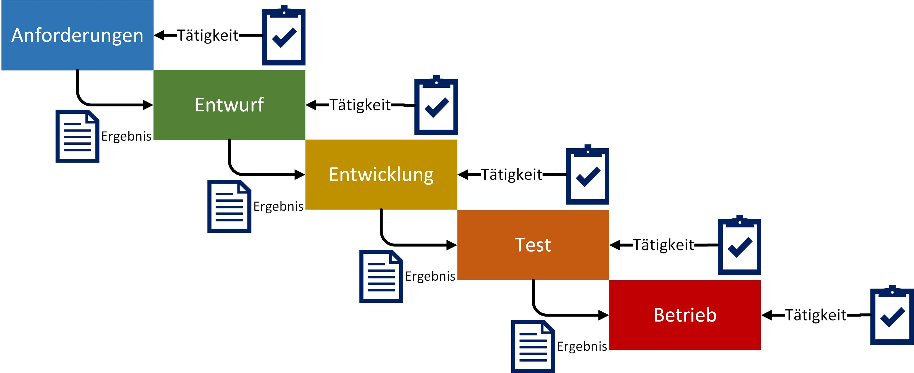
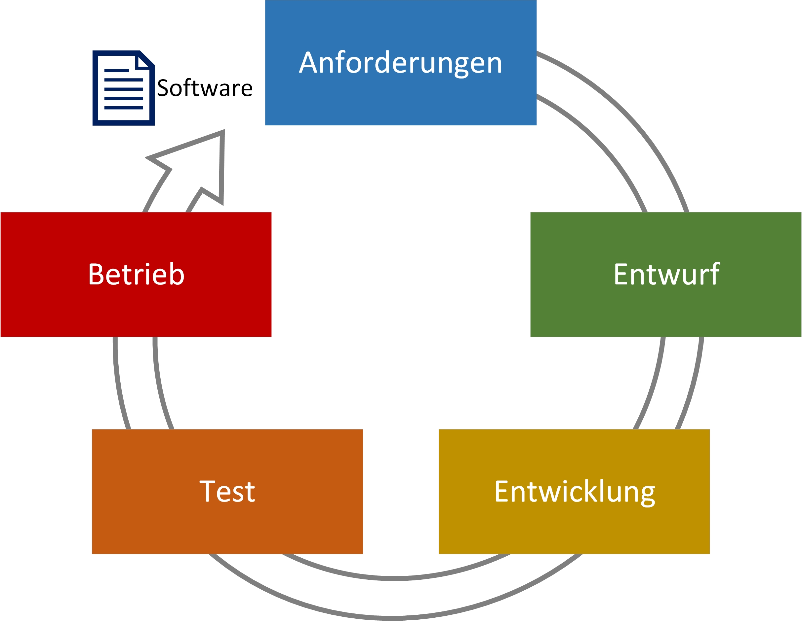
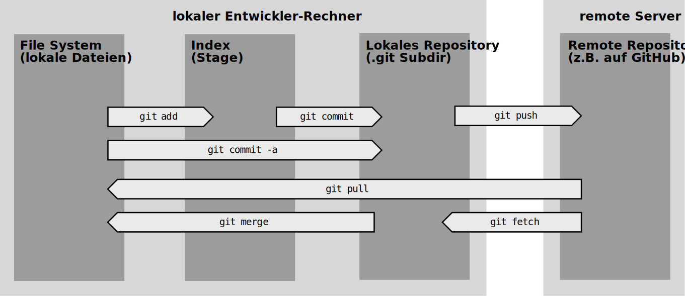
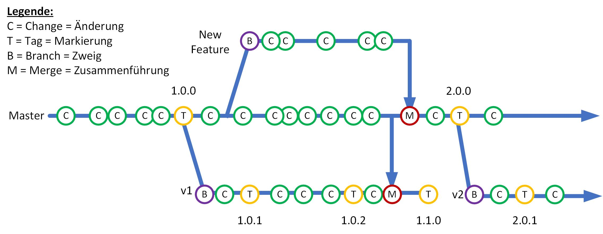

# Einführung in die Softwareentwicklung

## Phasen der Softwareentwicklung

Im Groben lassen sich 5 Phasen für dem Softwareentwicklungsprozess ausmachen:

1. Anforderungen: Anforderungsanalyse / Requirements Engineering
2. Entwurf: Design und Konzeption 
3. Entwicklung: Umsetzung und Implementation
4. Test: Testen der Software
5. Betrieb: Inbetriebnahme und Wartung beim Kunden



Je nach Quelle können diese Phasen variieren, abweichen, anderst benannt oder zusammengefasst sein.
Inhaltlich besteht der Softwareentwicklungsprozess immer aus den nachfolgenden Punkten:

### 1. Anforderungen

Während der Anforderungsanalyse sollen die Intention und Probleme, welche der Kunde hat, verstanden und herausgearbeitet werden. Für die weiteren Phasen ist es essentiell die Vorstellungen des Auftraggebers zu erkennen und diese nach und nach zu verfeinern und abzuklären. Aus diesen intensiven Gesprächen ergibt sich dann ebenso, welche Anforderungen essentiell für die Software-Lösung sind und welche eine niedrigere Priorität genießen. Die entstandenen Anforderungen an das Software-Produkt werden dann strukturiert und geprüft, bspw. auf Umsetzbarkeit oder auf Nutzen.
Meist können aus der Anforderungsanalyse ganze Berge aus Anforderungsdokumenten, ein Lastenheft, entstehen, dadurch kann eine Bewertung der Umsetzbarkeit äußerst kompliziert sein. Um hierbei dennoch eine grobe Abschätzung abgeben zu können werden meist die Phase 2: Design und die Phase 3: Entwicklung in einem kurzen Zyklus durchlaufen und es entsteht ein Prototyp (Klick-Dummy oder ähnliches). Anhand von diesem können weitere Anforderungen mit dem Kunden besprochen und somit die Einschätzung über Aufwand, Kosten, Nutzen und weiteres erleichtert werden.

[-> Mehr Infos zu Prototyping](https://www.dev-insider.de/was-ist-software-prototyping-a-794959/)  

> **Wichtig:** 
>
> Der Kunde bzw. Auftraggeber hat meist schon eine sehr konkrete Vorstellung seiner Software-Lösung im Kopf und möchte diese soweit es irgendwie möglich ist umsetzen. Das Problem dabei ist, die meisten Auftraggeber kommen nicht aus der Software Branche und können daher nur bedingt wissen, wie die Software-Lösung konkret konzipiert und umgesetzt wird, damit diese die kompletten Erwartungen erfüllt, vielleicht sogar übertrifft. Daher ist es in dieser Phase wichtiger nicht die, bereits gedankliche existierende, Lösung des Kunden zu verstehen, sondern die Intention und das Problem, welche dahinter steckt, dass die Software-Lösung überhaupt notwendig ist. 

### 2. Entwurf

Beim Design der Software-Lösung geht es in allererster Linie um die Gesamtarchitektur der Software und wird dann nach und nach immer weiter unterteilt, um somit für die Software Developer handhabbarer zu werden. Das Softwareprodukt wird in mehrere einzelne Stücke unterteilt, wodurch sich die Gesamtkomplexität verringert. Es werden die nötigen Programmstrukturen, Programmiertechniken und Algorithmen erarbeitet. Dabei kommen verschiedene Techniken wie beispielswese UML (vgl. L02_UML), Struktogramme, Prototypen und Pseudocode zum Einsatz. Mit diesen Objekten lassen sich die Machbarkeit der Software-Lösung feststellen, woraus dann meist skizzierte Lösungen zu den Anforderungen aus Phase 1 entstehen.

> **Wichtig:** 
>
> Während der Entwurfs- bzw. Design-Phase werden keine konrekten Lösungen im Programmcode festgelegt, sondern es werden Abläufe, Strukturen, Gegebenheiten, Architektur, etc. festgelegt, welche zum einen als Diskussionsobjekte dienen, um die Richtigkeit der erfassten Anforderungen zu überprüfen. Zum anderen als Vorlage bzw. skizzierten Entwurf wie die Software-Lösung in Phase 3 implementiert wird.

### 3. Entwicklung

Die skizzierten Lösungen zu den Anforderungen aus Phase 1 und Phase 2 werden von Software Developern in tatsächlichen Programmcode umgesetzt. Hierbei können verschiedene Praktikten und Techniken, wie bspw. Code-Conventions, Design-Patterns oder Pair Programmierung, etc. zum Einsatz kommen. Diese werden wir im Laufe des Semesters kennenlernen und darauf näher eingehen.

> **Wichtig:** 
>
> Bei der Implementierung der Anforderungen in Programmcode ist die schnellste Umsetzung nicht immer die beste Umsetzung. Umso mehr Anforderungen für die Software-Lösung es gibt, umso größer wird das endgültige Produkt. Deshalb ist es von sehr hoher Priorität, dass so viel wie möglich vom bestehenden Programmcode wiederverwendet werden kann, um unnötige Redunanzen von Programmcode zu vermeiden.

### 4. Test

In der Testphase werden die Anforderungen in Schritt 1 auf die korrekte Umsetzung geprüft, dafür gibt es meist eigene Software-Tester. Anhand der Anforderungen werden Testszenarien mit klaren Kriterien definiert, was eine Funktion, ein gewisser Programmteil können soll und was nicht. Bedeutet es werden Akzeptanzkriterien definiert, wann ein Test einer Funktion fehlschlägt bzw. erfolgreich ist.
An dieser Stelle sei gesagt, die Software Developer sind bereits in der Phase 3 in der Pflicht die Implementierung auf Lauffähigkeit und Korrektheit zu überprüfen. Hierfür gibt es den Ansatz des "Test Driven Developments", bei die Software Developer zuerst die Testszenarien (Unit Tests) erstellen und darauf aufbauend die Software-Lösung der entsprechenden Anforderung umsetzen.

[-> Mehr Infos zu Test Driven Development](http://www.evocomp.de/softwareentwicklung/unit-tests/unittests.html)

Abgesehen von manuellen Tests durch Software-Tester und Unit Tests, welche von Software-Developern erstellt werden, gibt es weitere Testverfahren für Software-Lösungen, bspw. Service- und Komponententests, Oberflächentests, Integrationstests, Systemtests, etc...

> **Wichtig:** 
>
> Zu erwähnen ist, dass diese Phase nicht das Ziel hat die Fehlerfreiheit der Software zu garantieren. Sie kann lediglich die Existenz von Fehlern aufzeigen, aber nicht deren Nichtvorhandensein. Bei der Konzeption der Testszenarien, Unit-, Service-, Komponententests und weiteren, ist es essentiell eine hohe Automatisierung der Testverfahren zu erhalten. Die manuelle Durchführung von Tests durch Personen ist sehr kostenintensiv und muss bei jeder neuen Version einer Software wieder und wieder erfolgen. Deshalb macht es an dieser Stelle Sinn gewisse Schnittstellen und Funktionen automatisiert durch eine Maschine testen zu lassen.

### 5. Betrieb

Zur Inbetriebnahme beim Kunden gehört ebenso die Veröffentlichung des fertigen Softwareprodukts. Die entstandene und getestete Software bekommt dabei eine Versionsnummer (Tag), wenn nicht sogar einen eigenen Branch in der Versionverwaltung und wird dem Kunden als ausführbare Software übergeben bzw. bei diesem installiert.
Der Kunde testet die Software und überprüft die Erfüllung der festgelegten Anforderungen aus Phase 1: Anforderungen und Phase 2: Entwurf. 
Dadurch können dann Mängel, bspw. Fehler bzw. Fehlverhalten, und / oder neue Anfordunderungen an die Software entstehen.
Diese können dann in einem weiteren Softwareentwicklungsprozess behoben bzw. umgesetzt werden.

> **Wichtig:** 
>
> Wie in Phase 4 schon beschrieben, kann keine Fehlerfreiheit garantiert werden. Mit der Zeit wird der Kunde Fehler entdecken, die dann von den Entwicklern angepasst werden. Es gilt der Grundsatz: "Das Projekt reift beim Kunden". Hinzu kommt, dass das Produkt immer wieder an Erweiterungen der genutzten Technik angepasst werden muss.

---

> **Frage:**
>
> Was denkt ihr: was kann bei so einem Software-Projekt alles schief gehen, wo können Fehler auftreten und wie können diese umgangen oder behoben werden?

> **TODO**
>
> Googelt bitte nach "Vorgehensmodelle Softwareentwicklung", geht auf "Bilder" und wählt ein Bild aus zu einem Vorgehensmodell. Lest euch 5 Minuten ein und schaut, welche der obigen Phasen ihr dort wiederfindet.

## Vorgehensmodelle



Ein Vorgehensmodell zur Softwareentwicklung ist ein für die Softwareentwicklung angepasstes Vorgehensmodell bei der professionellen „ingenieursmäßigen“ Anwendungsentwicklung. Es dient dazu, die Softwareentwicklung übersichtlicher zu gestalten und in der Komplexität beherrschbar zu machen.

Die bekanntesten Vorgehensmodelle:

- [Scrum](https://www.scrumguides.org/docs/scrumguide/v2017/2017-Scrum-Guide-US.pdf#zoom=100)
- [Kanban](https://www.projektmagazin.de/artikel/software-kanban-eine-einfuehrung_996703)
- [Wasserfall](http://cartoon.iguw.tuwien.ac.at/fit/fit01/wasserfall/welcome.html)
- [V-Modell XT](https://www.cio.bund.de/Web/DE/Architekturen-und-Standards/V-Modell-XT/Haeufig-gestellte-Fragen/haeufig_gestellte_fragen_node.html#doc2157266bodyText3)
- [Capability Maturity Model Integration: https://cmmiinstitute.com/cmmi](https://cmmiinstitute.com/cmmi)

[Übersicht über die Vorgehensmodelle](https://www.scnsoft.de/blog/vorgehensmodelle-der-softwareentwicklung)

### Scrum

Mittlerweile hat sich in der Softwareentwicklung das Vorgehensmodell Scrum als "state of the art" herauskristallisiert und wird hauptsächlich im professionellen Umfeld eingesetzt. Nachfolgend zeigt das Schaubild eine kurze Erklärung des Vorgehensmodell und dessen Akteure, Aktivitäten und Artefakte. Für weitere Informationen, dienen die nachfolgenden Links: 


[Quelle: https://www.konversionskraft.de/conversion-frameworks/strukturiertes-projektmanagement-fuer-optimierer-mit-scrum.html](https://www.konversionskraft.de/conversion-frameworks/strukturiertes-projektmanagement-fuer-optimierer-mit-scrum.html)

[Lektüre zu Scrum: Roman Pichler, Scrum: Agiles Projektmanagement erfolgreich umsetzen, 2007: https://www.romanpichler.com/romans-books/scrum/](https://www.romanpichler.com/romans-books/scrum/)

## Source Control

### Software besteht aus Dateien, die zusammen passen müssen

Bei der Erstellung von Software-Systemen (Webseiten, Mobile-Apps, Desktop-Programme, Games, Betriebsysteme, ...) 
werden Sourcecode-Dateien erstellt und bearbeitet. Nur selten besteht der Quellcode einer Software aus 
nur einer einzelnen Source-Datei. Neben mehreren (gerne auch mal mehreren tausend) Source-Dateien 
gibt es meist zusätzliche Dateien, die zur Laufzeit der Software zum Einsatz kommen, z.B. Grafiken
(Icons, Mauszeiger, Bilder), die in der grafischen Benutzeroberfläche angezeigt werden oder auch
Assets (3D-Modelle, Texturen) z.B. in Games.

Die Lauffähigkeit eines Softwaresystems hängt stark davon ab, dass die Informationen in den beteiligten
Dateien (Sourcecode und Assets) zusammen passt.

Beispiele:

- Eine Methode, die in einer Sourcecode-Datei aufgerufen wird, muss exakt so in einer
  anderen Datei definiert worden sein. 
- Ein 3D-Modell, das im Verlauf eines Game geladen wird und zur Laufzeit vom Benutzer 
  gesteuert werden soll, muss so aufgebaut sein, dass der Code auf die richtigen
  Einzelteile des Modells zugreifen kann.

### Mehrere Software-Entwickler

In sehr vielen Fällen sind mehr als eine Person an der Erstellung eines Software-Systems
beteiligt. Meist arbeitet jeder an der Entwicklung Beteiligte an seinem eigenen Rechner. 
Dort meistens an einer lokalen Kopie des gemeinsamen Projektes. 

> **FRAGE**
> 
> Wie kann sicher gestellt werden, dass die unterschiedlichen Arbeitsstände
> auf den lokalen Rechnern der Entwickler kontinuierlich zu einem funktionierenden
> Ganzen zusammen geführt wird?

### Sind Dropbox & Co. eine Lösung?

Cloud-basierte Speicher wie z.B. Dropbox, Google-Drive oder OneDrive werden oft verwendet, 
wenn Gruppen von Menschen gemeinsam an digitalen Inhalten arbeiten. Warum also bei einem
Software-Projekt nicht einfach irgendwo ein Cloud-Verzeichnis anlegen, so dass alle
Beteiligten gemeinsam dort Ihre Dateien und -Änderungen ablegen können.

Damit ist zumindest mal das Problem gelöst, wie Änderungen an einzelnen Dateien unter den
Beteiligten kommuniziert werden, nämlich vollautomatisch über die Synchronisierungsfunktion
der Cloud-Space-Clients.

Beim Einsatz dieser Technik zur Software-Entwicklung können folgende Situationen auftreten:

#### 1. Zu schnell synchronisiert
Ein Entwickler ändert eine Methode, indem er dieser z.B. einen weiteren Parameter hinzufügt. 
Nun müssen alle Aufrufe dieser Methode (die in anderen Dateien stehen) so geändert werden,
dass ein weiterer Parameter mit angegeben wird. Nach dem Ändern der Methodendefinition, aber
vor dem Nachziehen der Aufrufe synchronisiert der Cloud-Space-Client automatisch die Änderung.
Dadurch wird der Code nicht mehr lauffähig. Andere Entwickler, die nun diesen Stand ebenfalls
automatisch auf ihre Rechner synchronisiert bekommen, können nicht arbeiten, weil die 
Software nicht mehr läuft.

#### 2. Alten Stand sauber wiederherstellen
Oft ist es notwendig, den Stand aller an der Software beteiligten Dateien, so wie er zu einem
beliebigen Zeitpunkt war, wiederherzustellen. Dann muss gewährleistet sein, dass die Dateien
auch auf dem alten Stand zusammen passen. Einige Cloud-Space-Systeme bieten zwar an, auch 
mehrere Versionsstände von Dateien zu halten und diese wiederherstellen zu können, aber
selten kann man viele Dateien in unterschiedlichen Verzeichnissen gleichzeitig sicher auf
einen gemeinsamen Stand eines bestimmten Datums zurücksetzen. Zudem werden nur wenige Versionsstände
(z.B. 10 oder 20) gespeichert. 

#### 3. Gleichzeitig in einer Datei geändert
Zwei Entwickler fangen zur Zeit `t0` gleichzeitig an, in einer Sourcecode-Datei zu ändern.
Inhaltlich kommen sie sich nicht in die Quere, weil sie an ganz unterschiedlichen Methoden 
innerhalb einer großen Datei arbeiten. Zum Zeitpunkt `t1` speichert Entwickler 1 seine 
Änderungen, diese werden in die Cloud synchronisiert. Kurz darauf, zum Zeitpunkt `t2`, speichert
Entwickler 2 seine Änderungen. Diese werden ebenfall in die Cloud synchronisiert, dort
werden aber die Änderungen von Entwickler 1 wieder gelöscht, denn diese hatte Entwickler 2
ja noch nicht auf seinem Rechner, denn er hat auf dem Stand der Datei zum Zeitpunkt `t0`
seine Änderungen begonnen.

#### 4. Mehrere Versionsstände gleichzeitig pflegen
In größeren Softwareprojekten ist es nicht unüblich, dass gleichzeitig an mehreren Versionen 
der Software gearbeitet wird. Z.B. ist Version 1.1 der Software bereits ausgeliefert, es gibt
aber regelmäßige noch Updates mit Bugfixes (1.3, 1.4, ...). Gleichzeitig arbeitet das Team aber bereits an der 
Version 2.0, die natürlich alle Bugfixes, die noch in die alte Version einfließen, enthalten 
soll, zusätzlich aber mit neuen Features ausgestattet wird, die nicht mehr in die alte Version
fließen sollen.

Ein Umgang mit o.g. Situationen wird durch herkömmlichen Cloud-Space-Dienste gar nicht oder
nur schlecht unterstützt. Natürlich ließen sich alle Situationen durch vordefinierte manuelle
Abläufe oder Kommunikation unter den Entwicklern lösen.

> #### TODO
>
> Überlegt euch, ggf. gemeinsam, wie man oben genannte Probleme lösen könnte, wenn
> als Synchronisations-Technik für die Source-Dateien nur Dropbox & Co. zur Verfügung 
> stehen.

Die Komplexität hier wächst aber 
exponentiell mit der Anzahl der beteiligten Entwickler und der Anzahl der zu verwaltenden
Dateien an. Ab einer bestimmten Teamgröße und einem bestimmten Dateiumfang ist das nicht mehr
handhabbar, da zuviel Absprachen getroffen werden müssen und im Falle eines Fehlers dann
zu viele Entwickler für zu lange Zeit arbeitsunfähig sind. 

Abhilfe schaffen hier ***Source Control Systeme*** oder ***Version Control Systeme***, die, neben 
der Möglichkeit, Dateien über mehrere Rechner hinweg zu synchronisieren, für die o.g., 
häufig vorkommenden Situationen, spezielle Lösungen anbieten. Gegenüber Cloud-Storage-Systemen, 
die die lokalen Dateien der gemeinsam an einem Projekt arbeitenden Personen unauffällig im 
Hintergrund synchronisieren, haben Entwickler bei Source-Control-Systemen selbst die
Kontrolle, aber auch die Verantwortung und den Aufwand, den Datenaustausch zwischen lokalen
Dateien und dem gemeinsamen Projekt auf dem Server zu steuern. 

> #### TODO
>
> Googelt nach "Source Control", "Version Control" oder "Versionsverwaltung". Welche Software-Namen 
> tauchen häufig auf?  Von welchen Namen habt ihr schon mal gehört?

### Git

Im Folgenden wird gezeigt, wie die oben angesprochenen Aufgaben, die beim Umgang mit Software-(Source-)Dateien
anfallen, mit Hilfe des zurzeit sehr beliebten Source Control System ***Git*** gelöst werden.

#### Ein bisschen Geschichte

In der relativ jungen Geschichte der Software-Entwicklung wurden schon früh Source-Control-Systeme
eingesetzt. Dementsprechend gab und gibt es viele unterschiedliche Produkte mit unterschiedlichen
Features - sowohl kommerzielle wie kostenlose und OpenSource-Systeme. Hier ein historischer Überblick der 
weit verbreitetsten Systeme

Kurzname | Name                       | Erscheinungsjahr
---------|----------------------------|-----------------
SCCS     | Source Code Control System | 1972
RCS      | Revision Control System    | 1982
CVS      | Concurrent Version System  | 1989
SVN      | Subversion                 | 2000
Git      | "Depp"                     | 2005


#### Begriffe und Fakten

***Git*** ist der Name der Software, mit deren Hilfe eigene lokale oder server-basierte ***Repositories*** angelegt 
und verwaltet werden können. Die ursprüngliche Version von Git wurde von Linus Torvalds, dem 
Entwickler und Namensgeber des Linux-Betriebssystems entwickelt. 

Ein ***Repository*** ist eine Sammlung von Source-Dateien, die zu einem gemeinsamen Software-Projekt beitragen.

Oft, aber nicht zwingend, liegt ein gemeinsames zentrales Repository auf einem im Netz erreichbaren Server. Mit Git
können aber auch dezentral Repositories verwaltet werden.

Falls man keinen eigenen Server betreiben will, auf dem Git aufgesetzt werden muss, um dort zentrale Repositories
anlegen zu können, gibt es Dienstleister, die Server bereitstellen, auf denen man eigene Repositories hosten kann.
Die meisten Anbieter sind kommerziell, bieten aber für bestimmte Projekte oder bestimmte Nutzergruppen
ihre Dienste kostenlos an. Der bekannteste Dienst ist ***GitHub***. Hier kann jeder öffentliche Repositories anlegen 
(d.h. die dort gespeicherten Daten können von der ganzen Welt gelesen werden - gut für OpenSource
Projekte). Studenten, Profs und OpenSource-Organisationen können zudem auch kostenlos private Repositories 
anlegen. Weitere Anbieter wie z.B.  ***GitLab*** oder ***BitBucket*** bieten 
ähnliche Dienste an.

Um auf ein lokales, entferntes oder zentrales Repository zugreifen zu können, muss die Git Software installiert
sein. Diese wird auch oft "Git Client" genannt und besteht eigentlich aus einem Kommandozeilenprogramm "git".
Es existieren aber zahlreiche weitere oder zusätzliche Clients mit grafischer Oberfläche wie z.B. 
***GitHub Desktop*** oder ***GitKraken***. Darüber hinaus kann aus den meisten Software-Entwicklungs Werkzeugen und
Editoren direkt auf Git Repositories zugegriffen werden, z.B. mit Visual Studio, Visual Studio Code, Eclipse
und vielen anderen.

> ##### TODO
>
> Registriert euch (kostenlos) bei 
> [GitHub](https://github.io) und installiert 
> [GitHub Desktop](https://desktop.github.com/). Dabei wird auch gleich der "git" Kommandozeilen-Befehl
> mit installiert (über die App "Git Shell" oder den Menübefehl "Repository > Open in PowerShell" erreichbar). 

Die folgenden Szenarien und Beispiele spiegeln den häufigen Anwendungsfall wieder, dass ein 
zentrales Git-Repository bei einem Git-Anbieter wie GitHub angelegt ist und ein oder mehrere
Entwickler über ihre lokalen Rechner darauf zugreifen.

#### Git Terminologie

Beim lokalen Bearbeiten eines zentral gehaltenen Git-Repository, sollten ein paar Grundbegriffe
und Prinzipien verstanden werden. Diese sind hier kurz beschrieben.



Oben stehendes Bild zeigt ein Git-Repository, das auf einem Server liegt (rechte Säule) und
auf einem lokalen Entwicklerrechner bearbeitet wird (linker, breiter Balken). 

##### Lokales Dateisystem
Der ganz linke, dunkle Balken (***File System***) symbolisiert die lokalen Source-Dateien in ihrem aktuellen 
Bearbeitungszustand. Hier arbeitet ein Entwickler an den Source-Code (Text-)Dateien, 
bearbeitet ggf. Grafiken mit einem Bildbearbeitungsprogramm oder 3D-Modelle mit einer Modelling
Software. 

##### Lokales Repository
Der dritte dunkle Balken von links symbolisiert das lokale Repository. Mit Git wird _immer_ 
das gesamte Repository inklusive aller historischen Stände auf allen lokalen Rechnern gehalten.
Physisch liegt dieses Repository unterhalb des `.git` benannten Ordners in einem Git-Projekt
auf dem lokalen Rechner. Dessen Inhalt wird von git verwaltet und sollte nicht von Hand geändert
werden. Im lokalen Dateisystem geänderte Dateien können vom Benutzer mit entsprechenden Befehlen 
des Clients aktiv in das lokale Repository
übernommen werden, und von dort aus ins zentrale Repository auf dem Server weiter transportiert werden.

##### Index/Stage
Eine Eigenart von Git ist es, dass Änderungen an den Source-Dateien über einen ***Index*** genannten
Mechanismus (zweiter dunkler Balken von links) ins Repository gelangen. Geänderte Dateien müssen
hier erst aktiv vom Benutzer als geändert markiert werden, ansonsten werden Sie nicht
mit übertragen. Dieser Zwischenschritt bietet einerseits ein Mehr an Sicherheit und an Kontrolle
für Benutzer, andererseits entsteht hierdurch auch ein Mehr an Komplexität für Benutzer.
Daher kann dieser Schritt auch automatisiert erfolgen. Manche grafischen Git-Clients 
bieten diesen Schritt nicht an, sondern führen ihn automatisch im Hintergrund durch.

##### Pfeile
Die hellen Pfeile zeigen ein paar Möglichkeiten, wie eigene lokale Änderungen eines Entwicklers
in das gemeinsame zentrale Repository gelangen können (Pfeile nach rechts), bzw. wie
Änderungen, die von anderen Entwicklern bereits ins gemeinsame zentrale Repository 
eingepflegt wurden, in die eigenen lokalen Dateien einfließen können (Pfeile nach links).
Die in den Pfeilen stehenden Texte sind Git-Kommandozeilen-Befehle, die weiter unten
besprochen werden.

### Szenarien durchspielen

Im Folgenden sind eine Reihe von Szenarien, die das gemeinsame Arbeiten an einem Projekt simulieren.
Dazu sollen zweiergruppen gebildet werden und die **TODO**s abgearbeitet werden. 

Die meisten 
Aktionen lassen sich in GitHub Desktop auslösen. Soll der `git`-Kommandozeilenbefehl verwendet werden, kann
entweder die mit GitHub Desktop mitinstallierte App "Git Shell" gestartet werden, oder eine
Kommandozeile über den Menübefehl ""Repository > Open in PowerShell" eine Kommandozeile geöffnet werden.

#### Ein neues GitHub Projekt

Entwickler **A** legt ein Projekt an und Entwickler **B** "holt" sich das Projekt auf seinen Rechner.

> ##### TODO
> 
> - Bildet Zweiergruppen.
> - **A**: legt ein neues Git-Projekt auf Github (Navbar der Website -> new repository, ohne readme.md und .gitignore)
>     GitHub Desktop (Menü "File->New repository") an.
> - **A**: legt auf eurem Rechner einen neuen Ordner an und gebt in der Directory `git init` ein
> - **A**: fügt dem Projekt eine simple HTML-Datei (Mit einem Titel im Header und einer Textzeile im Body) zu.
> - **A**: speichert die Änderung (mit `git add .`).
> - **A**: überträgt die Änderung ins lokale Repository (mit `git commit -m 'initial commit'` oder mit dem Commit Button in 
>   GitHub Desktop).
> - **A**: sucht die URL für das repository (grüner clone-button -> HTTPS Link kopieren).
> - **A**: gebt euer GitHub Repo als Ziel an und ladet die Änderungen hoch (`git push –set-upstream kopierterLink`).
> - **A**: Macht Person B zum Contributor des Projektes (in den Projekt-Eigenschaften der GitHub-Web-Seite des
>   Projektes).
> - **B**: Holt sich erstmalig eine lokale Version des Remote-Repository mit `clone`.
>


#### Änderungen synchronisieren

Entwickler **B** ändert etwas und Entwickler A "holt" sich den neuesten Stand auf seinen Rechner.

> ##### TODO
>
> 1. **B**: legt eine neue Bilddatei in den Ordner und fügt das Bild per ``-Tag der HTML-Datei hinzu,
>   und fügt einen beschreibenden Text in die HTML-Datei ein.
> 1. **B**: überträgt die Änderung ins lokale Repository (mit `git commit -a` oder mit dem Commit Button in 
>   GitHub Desktop).
> 1. **B**: Lädt die Änderung ins Repository auf dem GitHub-Server (mit `push`).
> 1. **A**: Holt sich die Änderungen von B mit `pull`.

#### Zusammenhängende Änderungen einpflegen

Entwickler **A** ändert das Bild und passt den beschreibenden Text an. Beides wird gleichzeitig eingepflegt.

> ##### TODO
>
> 1. **A**: Ändert den Inhalt der Bild-Datei.
> 1. **A**: Ändert den beschreibenden Text in der HTML-Datei.
> 1. **A**: überträgt die Änderung ins lokale Repository (mit `git commit -a` oder mit dem Commit Button in 
>    GitHub Desktop).
> 1. **A**: Lädt die Änderung ins Repository auf dem GitHub-Server (mit `push`).
> 1. **B**: Holt sich die Änderungen von B mit `pull`.

#### Historischen Verlauf betrachten und alte Zustände wiederherstellen

Sämtliche bisher vorgenommenen Änderungen sind von Git gespeichert worden. Mit Änderungen sind gemeint:

- Änderungen an einzelnen Dateien
- Hinzufügen von neuen Dateien
- Löschen von Dateien
- Umbenennen oder Verschieben von Dateien 

der historische Verlauf wird in einem Git-GUI wie z.B. GitHub Desktop oder GitKraken direkt als Liste
angezeigt. Damit kann sehr gut verfolgt werden, welcher Entwickler wann welche Änderungen vorgenommen hat.
Hier zeigt sich auch, warum es sinnvoll ist, "gute" Kommentare beim `commit` anzugeben. Zudem sollte man
sich angewöhnen, Commits so aufzuteilen, dass diese thematisch zueinander passen. 

Einzelne Commits (Einträge in der Historie) werden in Git mit SHAs identifiziert. Einzelne SHAs können z.B.
in GitHub Desktop durch rechts-Klick auf einen Hinstory-Eintrag (einen Commit) in die Zwischenablage
kopiert werden. SHA-Werte sind zu lang, um sie abzutippen oder im Kopf zu behalten und daher unhandlich, 
wenn sie nicht über die Zwischenablage kopiert werden können. Daher gibt es die SHA-Werte jeweils auch in 
einer Kurzversion.

> ##### TODO
>
> Um einen alten Zustand ***temporär*** herzustellen:
> - Betrachtet den bisherigen Verlauf der Commits in GitHub Desktop oder in 
>   der Kommandozeile (mit `git reflog` (Kurzversion) oder `git log` (Langversion)).
> - Sucht einen Stand aus, den Ihr wiederherstellen wollt und merkt/speichert dessen SHA-Wert
> - Öffnet das Repository in der Kommandozeile (falls noch nicht geschehn)
> - Stellt den gewünschten alten Zustand mit folgenden Kommando her: `git checkout <SHA>`
> 
> Es erscheint eine WARNUNG
> ```
> You are in 'detached HEAD' state. ...
> ```
> Alle Dateien im Arbeitsverzeichnis befinden sich nun im alten Zustand. Hier sollte allerdings
> nichts geändert werden, der alte Zustand kann aber betrachtet werden. Um alle Dateien wieder 
> in den aktuellen Zustand zu bringen:
> - Gebt auf der Kommandozeile ein: `git checkout master`

Neben dieser Prozedur können auch einzelne commits rückgängig gemacht werden. Da das Rückgängig machen 
eine Änderung darstellt, wird dieser Schritt ebenfalls gleich in die History eingetragen. Hier sollte
man wissen, was man tut, wenn man Commits NICHT in umgekehrter Reihenfolge rückgängig macht!

> ##### TODO
>
> Um einen einzelnen Commit rückgängig zu machen:
>
> In GitHub Desktop
> - Rechts-Click auf den letzten Commit
> - ***Revert this Commit***
>
> In der Kommandozeile
> - `git revert <SHA> --no-edit`


Schließlich können alte Zustände auch dauerhaft wieder hergestellt werden, d.h. alle später 
hinzugekommenen commits werden gelöscht. Das geschie

 > ##### TODO
 > 
 > Um einen alten Commit ***dauerhaft*** als letzten Stand festzulegen, 
 > - in der Kommandozeile `git reset <SHA>` eingeben.


#### Gleichzeitig in einer Datei ändern

Viele Dateien in Software-Projekten sind Text-Dateien. Git (wie auch andere Source-Control-Systeme)
ist in der Lage, nach einer Änderung festzustellen, welche Zeilen von Änderungen betroffen sind.
Wird eine Datei von zwei Entwicklern zwar gleichzeitig geändert, befinden sich die Änderungen aber
in unterschiedlichen Zeilen, führt Git die Änderungen *automatisch* zusammen. 

Ein solches Zusammenführen von Änderungen, ob automatisch oder Manuell, nennt man ***Merge***

> ##### TODO
>
> 1. **A** ändert die Titelzeile der HTML-Datei und speichert die Datei lokal
> 2. **B** ändert den Text im Body der HTML-Datei uns speichert die Datei lokal
> 3. **A** Führt einen `commit` aus, danach einen `push`. Somit sind die Änderungen auf dem Server.
> 4. **B** Führt einen `pull` aus -> Es wird automatisch ein Merge durchgeführt.
> 5. **B** hat jetzt bereits den zusammengeführten Stand (eigene Änderungen und die von B)
> 6. **B** kann jetzt den gemeinsamen Stand als neuen Stand per `commit` und `push` publizieren.
>
> - Betrachtet die History in Git for Windows und findet heraus, wie man einen automatisch
>   durchgeführten Merge erkennen kann.
>
> Diese Reihenfolge muss so nicht zwingend eingehalten werden. **B** kann nicht immer wissen, das
> Änderungen vorliegen
> 
> - Findet heraus, was passiert, wenn in o.a. Sequenz Entwickler **B** statt Schritt 4 einfach,
>   wie bisher auch direkt seine Änderungen per `commit` und `push` publizieren will. 
>

Das automatische Zusammenführen ist ein mächtiges Feature und erlaubt in großen Software-Projekten 
mit vielen Entwicklern und großen Source-Dateien ein reibungsloses gleichzeitiges Arbeiten.

Trotzdem ist es mit Vorsicht zu genießen. Git hat keine Ahnung über die inhaltliche Bedeutung der 
Dateien. Auch wenn Git in bester Absicht zwei vermeintlich unabhängige Änderungen automatisch 
mergt, weil sie sich in unterschiedelichen Zeilen befinden, kann es passieren, dass die dabei
entstehende Datei syntaktische oder semantische Fehler enthält. So kann es in Programm-Code
vorkommen, dass die Block-Klammerungen über mehrere Zeilen  (`{` und `}`) nicht mehr richtig 
zu einander passt. In XML-Dateien können Fehler entstehen, weil zu einem 
öffnenden `<Tag>` nicht mehr das passende schließende `</Tag>` vorhanden ist.

Daher sollte folgende Regel selbstverständlich sein: Wurden nach einem `pull` oder einem 
expliziten `merge` Änderungen zusammen geführt, muss vor dem `commit` der zusammen geführten
Änderungen die Lauffähigkeit geprüft werden.

#### Gleichzeitig in einer Datei an der selben Stelle ändern

Wenn Git bei einem Commit feststellt, dass zwei Entwickler gleichzeitig in der selben Zeile
einer Datei Änderungen vorgenommen haben, kann Git keine automatische Lösung anbieten. 
In diesem Fall meldet Git einen Konflikt (***conflict***). 

> ##### TODO
>
> Provoziert einen Konflikt
> 
> 1. **A** ändert die Titelzeile der HTML-Datei und speichert die Datei lokal
> 2. **B** ändert den **ebenfalls** die Titelzeile HTML-Datei uns speichert die Datei lokal
> 3. **A** Führt einen `commit` aus, danach einen `push`. Somit sind die Änderungen auf dem Server.
> 4. **B** Führt einen `pull` aus -> Es wird versucht, ein Merge durchgeführt. Dieser scheitert
>          und Git meldet einen Konflikt
>

Beim Auftreten eines Konflikts speichert Git die Datei, in der der Konflikt auftrat in einem 
speziellen Format. Die beiden Versionen der betroffenen Zeile(n) werden mit Folgen von 
`<<<<<<<< HEAD`, `==========` und `>>>>>>>>` (*conflict marker*) voneinander getrennt. 

> ##### TODO
>
> Löst den Konflikt
> 
> 1. **B** Öffnet die HTML-Datei im Editor, fügt die gewünschte aus beiden Änderungen 
>   resultierende Titelzeile und löscht die conflict marker.
> 2. **B** führt einen `commit` des aufgelösten Konfliktes durch, gefolgt von einem `push`.
>

Zum Lösen von Konflikten gibt es spezielle Editoren, die anhand der conflict marker und 
der drei unterschiedlichen Stände der Datei (*vor* beiden Änderungen, Änderung von **A**
und Änderung von **B**) dem Benutzer das Editieren von Conflicts erleichtern. Meistens 
gibt es in solchen ***Merge Tools*** folgende Features

- Gleichzeitige Anzeige der drei oder vier unterschiedlichen Datei-Versionen (Stand 
  vor allen Änderungen, Änderungen von A, Änderungen von B, vom Benutzer von Hand
  editierte Änderungen) inklusive gleichzeitigem Scrollen in allen Versionen.
- Gezieltes Anspringen von erkannten Konfliktstellen gleichzeitig in allen Versionen
- Annehmen von Änderung A oder Änderung B durch Knopfdruck
- Editieren der finalen Konfliktlösung per Hand

In Git kann das zu verwendende Merge Tool mit dem Kommando `git config --global merge.tool <mergetool>`
festgelegt werden. Ein derart festgelegtes Tool kann dann im Falle eines Konfliktes
mit `git mergetool <filename>` für eine bestimmte konfliktionäre Datei aufgerufen werden.

Jedem Git-Anwender wird ***dringend*** empfohlen, sich ein brauchbares Merge Tool
zu installieren. [Hier](https://www.slant.co/topics/1324/~diff-tools-for-git) sind eine
Reihe derartiger Tools aufgelistet, davon ist z.B. P4Merge kostenlos.

> ##### TODO
>
> - Installiert ein Merge Tool.
> - Provoziert weitere Konflikte (z.B. mehrere in mehreren Dateien gleichzeitig) und löst diese 
>   mit dem Merge-Tool.

### Branches und Clones



Mit dem bis jetzt Gelernten haben wir einen Werkzeugkasten, mit dem wir 
die Synchronisierung der Änderungen der an einem Projekt beteiligten Entwickler sehr
feingranular steuern können. 

Noch komplexer wird es, wenn in einem Projekt nicht nur **ein** Zustand als der aktuelle
gelten soll, sondern wenn gleichzeitig mehrere Zustände des Projektes geführt werden 
sollen und wenn dann auch noch einzelne Änderungen gezielt zwischen diesen Zuständen
ausgetauscht werden sollen. Oben ist bereits ein Beispiel genannt, bei dem
so etwas sinnvoll sein kann: Von einer Software soll eine neue Version entstehen, dort
sollen neue Features entwickelt werden. Gleichzeitig soll der alte Stand der Software weiter
mit Updates wie z.B. Bugfixes beliefert werden. Wurde ein Bug im alten Stand der Software
gefixt, sollen die dazu notwendigen Änderungen auch gleich in die neue Version eingepflegt
werden. 

#### Branches

Für derartige Szenarien gibt es in Git (wie in vielen anderen Source-Control-Systemen auch)
so genannte ***Branches*** (Verzweigungen). Wenn man sich eine Folge von Commits als
einen wachsenden Ast von Entwicklungsschritten vorstellt, kann mit Hilfe eines Branches
ein Nebenast angelegt werden, der von einem gemeinsamen Startpunkt aus eine eigene, zeitlich
parallele Entwicklungshistorie nehmen kann.

Grundsätzlich gilt:

- In jedem Git-Projekt gibt es mindestens einen Haupt-Branch. Dieser heißt `master`.
- In jedem Git-Projekt kann es beliebig viele weitere Branches geben. Diese können
  benutzerdefinierte Namen tragen.
- Einzelne Commits eines Branches können durch den Benutzer in einen anderen Branch
  übernommen werden. Da oft gleichzeitig an mehreren Branches gearbeitet wird, ist
  oft ein manueller oder automatischer Merge (s.o.) notwendig.

> ##### TODO
>
> - Schafft euch pro Entwickler einen eigenen Branch auf dem ihr arbeitet.
>   Mit GitHub for Desktop:
>   - Feld "Current Branch" aufklappen. im "Filter" einen neuen Branch-Namen eingeben
>   - Button "New Branch" klicken.
>
>   Mit der Kommandozeile
>    - `checkout -b <Neuer Branch-Name>`
>
> - **A** und **B**: Jeder führt eigene Änderungen in jeweils seinem eigenen Branch durch.
> - **A** und **B**: Publiziert Eure Änderungen mit `commit` und `push`
>

Auf diese Weise sind die Änderungen zunächst vollkommen losgelöst voneinander. Es sind
keine Merges notwendig und es gibt keine Konflikte. Allerdings werden auch die Änderungen
nirgendwo in einem gemeinsamen Stand zusammen geführt. 

> ##### TODO
>
> Überzeugt Euch davon, dass es zwei unterschiedliche Branches gibt.
>
> - Holt euch mit `pull` den letzten Stand.
> - Klappt in GitHub for Desktop das Feld "Current Branch" auf.
> - Wechselt ggf. den Branch und überzeug euch, dass alle Dateien des Projektes
>   auf den jeweiligen Stand im Branch gebracht werden. 

Änderungen können nun explizit mit `merge` von einem Branch in den anderen übertragen 
werden.

> ##### TODO
>
> - Klappt in GitHub for Desktop das Feld "Current Branch" auf
> - Wechseln in den Branch, der die Änderungen eines anderen Branches ***empfangen*** soll.
> - Wählt im Menü "Branch" den Befehl "Merge into current branch..." aus.
> - Wählt im Dialog dann den Branch aus, von der die zu übertragenden Änderungen enthält
> - Ggf. erfolgt ein Merge mit Konflikten. Löst die Konflikte mit dem Merge Tool.
> - Überzeugt euch, dass die Änderungen im aktuellen Branch angekommen sind.

##### Branching Strategien

Es gibt eine ganze Reihe von Szenarien, in denen Branches sinnvoll sein können. Für alle
Szenarien gibt es _best practices_, wie Branches eingesetzt werden können. 

> ##### TODO
>
> - Googelt nach "Branching Strategies" und versucht, ein paar der angezeigten Links zu verstehen.

Folgende Szenarien kommen häufig zum Einsatz, die manchmal auch miteinander kombiniert werden.

- **Master** und **Develop** Die aktuelle stabile Version einer Software wird im _master_ Branch
  gehalten. Aktuelle Änderungen und Entwicklungen finden im _develop_ Branch statt. Wenn dort ein
  stabiler Zustand erreicht ist, wird nach _master_ gemergt.
- **Version Branches** Für jede Version einer Software gibt es einen eigenen Branch. Wird vor allem 
  dann eingesetzt, wenn an mehreren Versionen gleichzeitig entwickelt wird, z.B. bei Updates alter
  Versionen oder mehreren Kundenspezifischen Anpassungen. Änderungen, die in anderen Versionen 
  benötigt werden, können gezielt per merge eingespielt werden.
- **Developer Branches** Jeder Entwickler arbeitet auf einem eigenen Branch. Von Zeit zu Zeit pflegen
  die Entwickler ihre Änderungen in einen gemeinsamen Entwicklungsbranch ein.
- **Feature Branches** Jedes neu zu entwickelnde Feature wird in einem neuen Branch angelegt und dort
  zu einer gewissen Reife gebracht. Erst, wenn die Neuentwicklung stabil genug ist, wird sie in 
  einen gemeinsamen Branch eingepflegt.

Allgemein gilt: Git hebt sich von anderen Source-Control-Systemen dadurch ab, dass Branches 
weder für den Anwender noch für das System aufwändig ist. Daher können Branching Strategien 
zum Einsatz kommen, die von vielen und häufig durchgeführten Branches und Merges abhängig sind.

Es ist nicht ungewöhnlich, dass erfahrene Entwickler gleichzeitig mehrere eigene Branches betreiben.

#### Forks

In Projekten, bei denen das Entwicklerteam nicht fest definiert ist, ist es oft schwierig, 
verteiltes Arbeiten nur mit Hilfe von Branches zu ermöglichen. Jeder Entwickler, der in einem 
Projekt/Repository Branches anlegen soll, muss als Contributor eingetragen werden. Gleichzeitig
kann jeder Contributor auch viel kaputt machen (z.B. den master Branch löschen...). In Git
gibt es nur eine sehr eingeschränkte Benutzerkontrolle, die versehentliche oder böswillige
Aktionen verhindern kann.

Bei sehr verteilten (typischerweise OpenSource) Projekten, insbesondere wenn diese auf einem
Dienst wie GitHub gehalten werden, arbeiten weltweit Entwickler, die sich untereinander nicht 
kennen, ad-hoc an gemeinsamen Projekten. Hier wird daher oft mit ***Forks*** gearbeitet. 

Dabei legt sich jeder Entwickler, der an einem Projekt mitarbeiten will, zunächst mal ein
eigenes Repository als Kopie des ursprünglichen Projektes an. Hier kann er nach Belieben 
eigene Änderungen durchführen, commiten, Branches anlegen und löschen, etc., ohne 
irgendetwas kaputt zu machen. 

Hat ein Entwickler eine Änderung durchgeführt, die er gerne in das ursprüngliche Projekt
einfließen lassen will, kann ein so genannter ***Pull-Request*** an den Eigentümer des 
ursprünglichen Projektes gestellt werden. Dieser kann sich die (zunächst vorgeschlagene)
Änderung ansehen, probehalber in den aktuellen Stand des eigenen Projektes mergen, 
ausprobieren und ggf. übernehmen, überarbeiten, kommentieren oder zurückweisen. 

Git / GitHub unterstützt das Auslösen und das Bearbeiten von Pull-Requests. 
