# UML: Unified Modeling Language

## Über UML

Source-Code ist nur bedingt geeignet, um Software zu entwerfen:

- Source-Code ist von Menschen nicht intuitiv lesbar. Um z.B. in einem Team die Idee eines 
  Software-Entwurfs vorzustellen, ist Source-Code oft zu unhandlich. 

- Source-Code ist aufwändig zu schreiben. Es ist wünschenswert, eine Idee für einen 
  Entwurf _einmal kurz_ skizzieren zu können.

- Source-Code ist zu komplex, um -ggf. noch unvollständige- Ideen festzuhalten, um 
  in diesem Entwurf z.B. Fehler erkennen zu können, Alternativen aufzuzeigen, etc.

- Source-Code ist zu unübersichtlich, um in einem Entwurf den Fokus auf einen bestimmten
  Sachverhalt zu lenken, und andere, für diesen Sachverhalt unwichtige, Bestandteile
  wegzulassen.

Ähnlich wie beim Hausbau, wenn ein Architekt eine grobe Skizze anfertigt, 
um damit Verständnis zu schaffen, ist es ebenfalls in der Softwareentwicklung der Wunsch, solche Werkzeuge zu besitzen.
Solch eine Notation sollte es erlauben, Software-Entwürfe vage darzustellen und festzuhalten. Die Modellierung nach der Notation
ermöglicht dann, Designs (Entwürfe, Skizzen, Abläufe, etc.) zu erarbeiten und diese iterativ zu verfeinern.
Diese Ergebnisse dienen dann dem Software Developer als Grundlage, um diese dann _ins Reine_ - also in lauffähigen Code umzusetzen.

Jeder Software-Entwickler, der schon mal an einer komplexeren Aufgabe saß, hat höchstwahrscheinlich
auch schon mal Ideen, Konzepte, Entwürfe in einer intuitiven, selbst ausgedachten Notation
auf Papier gezeichnet. Spätestens, wenn der Software-Entwurfsprozess arbeitsteilig gestaltet
werden soll, ist es sinnvoll, sich auf eine einheitliche Notation zu einigen, um 
Entwürfe untereinander im Team austauschen zu können. Hier setzt die **Unified Modeling Language (UML)** an.

Die Entwicklung der UML begann Mitte der 1990er Jahre, vorangetrieben vor allem
von den "drei Amigos": Grady Booch, James Rumbaugh und Ivar Jacobson. Alle drei arbeiteten bereits zuvor an
Schemata zur Planung von Software mit grafischen Hilfsmitteln und begannen schließlich bei der 
Firma Rational Software mit der Entwicklung einer gemeinsamen grafischen Sprache.
Die Version 2.5 der UML wurde im Mai 2015 veröffentlicht 
([siehe Website der Object Management Group](http://www.omg.org/spec/UML/2.5)).
Dort ist auch die umfangreiche [Spezifikation](http://www.omg.org/spec/UML/2.5/PDF) zur finden. Es sind einige Arten von Diagrammen für unterschiedliche Zwecke definiert. In der Folge sollen nur **Anwendungsfall, Aktivitäts-
und Klassendiagramme** betrachtet werden.

> #### TODO
> - Schaut Euch die Übersicht über die 14 Diagrammtypen auf folgender Web-Seite an:
>   https://creately.com/blog/diagrams/uml-diagram-types-examples/
>
> - Identifiziert die hier besprochenen Diagrammtypen (Use Case, Aktivität und Klassen). Zu 
>   welchen Haupt-Kategorien zählen diese jeweils?
>
> - Schaut Euch die Beschreibung weiterer, hier nicht besprochener Diagrammtypen
>   an. Diskutiert untereinander, unter welchen Typen könnt ihr euch eine Anwendung
>   vorstellen könnt. Welche Diagrammtypen sagen euch überhaupt nichts?

## Literatur
[Oesterreich, Bernd: Die UML-Kurzreferenz 2.5 für die Praxis: kurz, bündig, ballastfrei; 2014](https://www.amazon.de/Die-UML-Kurzreferenz-2-5-f%C3%BCr-Praxis/dp/3486749099)

## Use Case Diagramm / Anwendungsfalldiagramm

Das Use Case Diagramm besteht im Wesentlichen aus drei unterschiedlichen Elementen. Den Akteuren, die Rolle bzw. Person im System, den Anwendungsfällen, die Funktionen bzw. Aufgaben des Systems, und deren Beziehungen untereinander.
Also klärt ein Use Case Diagramm über folgende Fragen auf:

  - Welche Rollen bzw. Personen gibt es in einem System?
  - Welche Aufgaben bzw. Funktionen soll das System erfüllen?
  - Welche Rolle darf welche Aufgabe innerhalb des Systems verwalten bzw. ausführen?
  - Wie sind die Rollen miteinander verknüpft?
  - Welche Aufgaben bzw. Funktionen baut auf einer anderen Aufgabe bzw. Funktion auf?

Damit beschreiben Use Case Diagramme also kein Verhalten und keine Abläufe eines Systems.
Sondern nur die Anwendungsfälle, welche ein System abdecken soll und wie die Zusammenhänge untereinander und mit den Akteuren sind.

#### FRAGEN
 - Für was brauche ich ein solches Use Case Diagramm?
 - Was denkt ihr: was ist der Nutzen des Use Case Diagramms?
 - In welcher Phase des Softwareentwicklungsprozess kommt dieser Diagrammtyp zum Einsatz?

Use Case Diagramme dienen hauptsächlich zur Kommunikation zwischen Requirements Engineer (in Scrum: Product Owner) und den Stakeholder bzw. den tatsächlichen Anwendern des Systems. Die Anwendungsfälle beschreiben das Angebot des Systems und die Interaktion der Außenstehenden mit dem System. 

### Fazit: _Use Case Diagramme stellen damit eine grobe Leistungsbeschreibung des Systems als Skizze dar._

#### Beispiel:
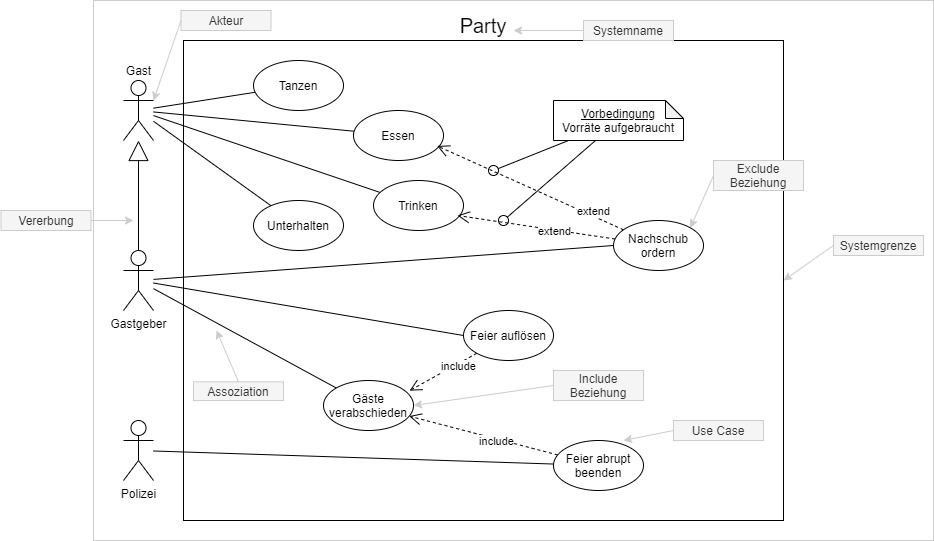

#### Aufgabe

> Im FELIX Kurs bzw. hier im GitHub Repository, unter [Task01](tasks/usecase_task_L02.txt), liegt eine Mail einer potentiellen Kundin, welche eine App beauftragen möchte. Bitte die Lösungen über FELIX hochladen, alle weiteren Infos zur Abgabe findet Ihr im FELIX Kurs.

Hinweis: Die Lösungen für UML könnt Ihr entweder auf Blatt Papier skizzieren, dann fotografieren oder einscannen. Oder Ihr erstellt die Diagramme über [app.diagrams.net](https://app.diagrams.net/), ein Online Tool um jegliches Diagramm zu zeichnen, es ist keine Registrierung erforderlich.

## Aktivitätsdiagramme
Mit Aktivitätsdiagrammen lassen sich ganz unterschiedliche Abläufe auf verschiedenen Abstraktionsebenen
beschreiben. Von generellen Prozessen, bei denen keine Maschinen beteiligt sind, bis zu Algorithmen für 
Computerprogramme. Dabei ist es möglich auch komplexe Abläufe mit Ausnahmen, Verzweigungen, Sprüngen und
Wiederholungen noch übersichtlich darzustellen, was in natürlicher Sprache nicht gelingen würde. Die
wesentlichsten Elemente sind dabei recht einfach zu erlernen.

### Einfachste Elemente
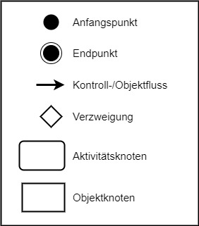

### Beispiel
Grundsätzlich wird der Ablauf durch Pfeile dargestellt, welche als Kontroll- bzw. Objektfluss bezeichnet 
werden. Es kann einen oder mehrere Start- und Endknoten geben. Im einfachsten Fall erfolgt der Fluss von
einem Startknoten über Aktivitätsknoten zu einem Endknoten. 

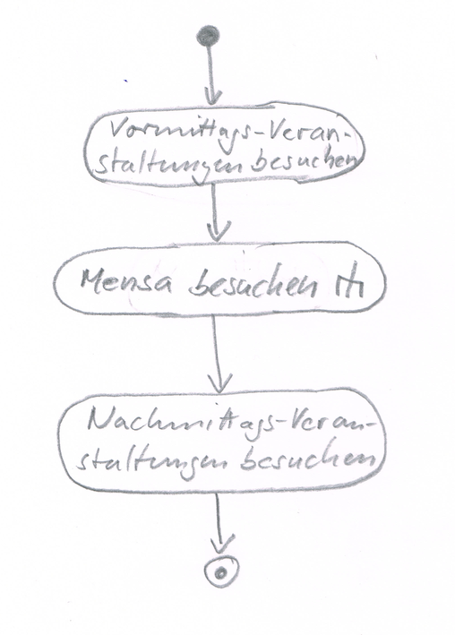

Die kleine Gabel bei der Aktivität "Mensa gehen" bedeutet, dass diese Aktivität an einer anderen Stelle
weiter ausgeführt wird. Dies könnte beispielsweise folgendermaßen aussehen:

Nach "An der Tür Menüs lesen" erfolgt eine Verzweigung. Sofern kein Menü zusagt wird die Mensa verlassen
und der Ablauf beendet. Erfolgt jedoch eine Wahl, so wird ein Objektknoten angelegt, welcher durch den
folgenden Fluss weiter gereicht wird und die Information über das gewählte Menü enthält. Nachdem das Tablett
genommen wurde, erfolgt eine Verzweigung auf Basis dieser Information, so dass die richtige Schlange für 
das Anstehen gewählt wird. Dann folgt eine Schleifenstruktur, womit das Aufrücken in der Schlange gewährleistet
wird. Das gewählte Menü ist für die dann folgende Aktivität erneut von Bedeutung, weshalb mit Hilfe des kleinen
Rechteckes am Eingang dargestellt wird, dass hier der Objektfluss eine Rolle spielt und der Aktivität 
entsprechende Information übergeben werden muss. Schließlich muss der Kunde angeben, ob er tatsächlich das 
Menü oder doch den schnellen Teller möchte. "Bezahlen" und "Platz suchen und essen" sind wieder komplexe 
Abläufe, die mit dem Gabel-Symbol versehen sind und an anderer Stelle ausgeführt werden
(nicht im Beispiel enthalten).

### Parameter
Die Aktivität "Wahl äußern und Teller erhalten" im Beispiel nimmt also ein Objekt aus dem Objektfluss
entgegen. Wird eine Aktivität im Detail dargestellt, werden ein- und ausgehende Objekte als Rechtecke 
auf den Rahmen gezeichnet.

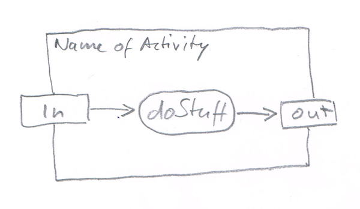

Somit wird die Schnittstelle der Aktivität erkennbar, diese Objekte werden als Parameter der Aktivität 
bezeichnet. Die Parameter können als Start- und Endpunkte der Aktivität dienen. Es ist nun leicht, 
bei der Softwareentwicklung die Aktivität in eine Funktion zu übersetzen.

### Weitere Elemente

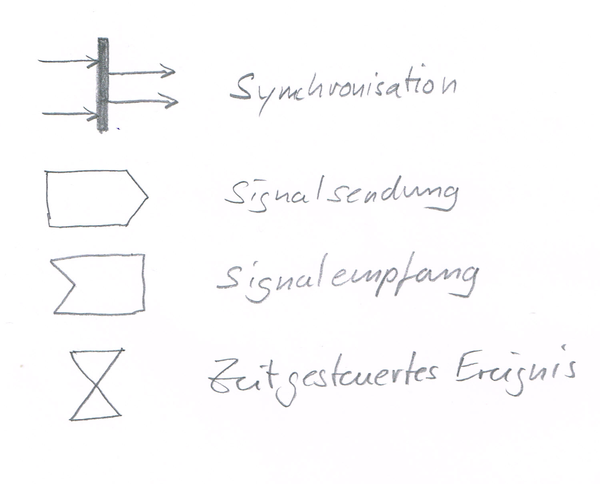

#### Synchronisation
Anders als bei der Raute, welche eine Verzweigung und/oder einen Zusammenfluss darstellt, bei dem jeweils
nur ein einziger Kontroll- bzw. Objektfluss aktiv ist, werden bei der Synchronisation mehrere Flüsse
gleichzeitig aktiv. Das bedeutet, dass diese Flüsse dann parallel abgearbeitet werden. Die abgehenden 
Flüsse werden dann aktiv, wenn bei der Synchronisation alle eingehenden Flüsse angekommen sind. 
Synchronisation kommt vordringlich beim Entwurf von Nebenläufigkeiten zum Einsatz. 

#### Ereignisse
Als Startknoten kann auch ein Signalempfang dienen. Das kann beispielsweise eine Nutzerinteraktion sein, 
ein Tastendruck, ein Mausklick oder Touch. Ebenso können Signale gesendet werden, zum Beispiel ein 
Request an einen Server. Die Response kann dann als Signalempfang den Start einer Aktivität auslösen. 
Hier einige stark vereinfachte Beispiele.

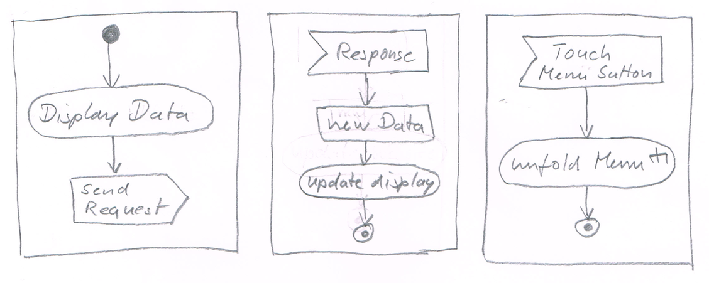

Für den Empfang zeitgesteuerter Ereignisse existiert zudem ein spezielles Symbol, welches einer Sanduhr
ähnelt.

### Weitere Spezifikationen
Im Detail gibt es noch sehr viel weiter greifende Spezifikationen für Aktivitätsprogramme, welche der 
entsprechenden Literatur zu entnehmen sind. Für einen ersten groben Entwurf von Software sollten die
hier angeführten allerdings weitestgehend genügen.  

> #### TODO
>
> - Zeichnet für einen Alltagsvorgang (Spülen, Wäsche waschen, Koch-Rezept umsetzen)
>   ein Aktivitätsdiagramm, bei dem mindestens eine Entscheidung getroffen werden 
>   muss und in der eine sich wiederholende Teilaktivität vorkommt.
>
> - Übersetzt das Diagramm in C#-Pseudo-Source-Code (der nicht lauffähig sein muss),
>   in dem ihr die Ablaufstrukturen (Verzweigung, Wiederholung) in geeignete C#-Anweisungen 
>   umwandelt und jeden Aktivitätsknoten (abgerundetes Rechteck) in einen Methodenaufruf
>   einer imaginären Methode (z.B. `SalzHinzufügen()`) umwandelt.
>
> - Sucht euch eine bereits implementierte Methode aus einer der vorangegangenen 
>   Programmierbeispiele und zeichnet zu der Methode ein passendes Aktivitätsdiagramm.

## Klassendiagramme
Klassendiagramme stellen den Aufbau von Klassen und Zusammenhänge zwischen ihnen bzw. deren Objekte dar.
Das Klassendiagramm ist die wohl bekannteste und wichtigste Diagrammform der UML mit vielen Details. 
Es soll hier nur auf eine Auswahl der Notationen eingegangen werden, die es schon ermöglicht, 
komplexere objektorientierte Softwareprojekt relativ einfach und schnell zu planen und zu dokumentieren.

### Klasse
Eine Klasse wird dargestellt als einfaches Rechteck, welches horizontal in drei Teile geteilt wird.
Im oberen Teil ist der Klassenname angegeben, im mittleren Teil die Eigenschaften (Eigenschaften,
Properties) und im unteren Teil die Methoden, welche die Klasse zur Verfügung stellt. Wenigstens 
der obere Teil mit dem Namen muss vorhanden sein, die anderen beiden Teile sind je nach Ausprägung 
des Diagramms optional.  

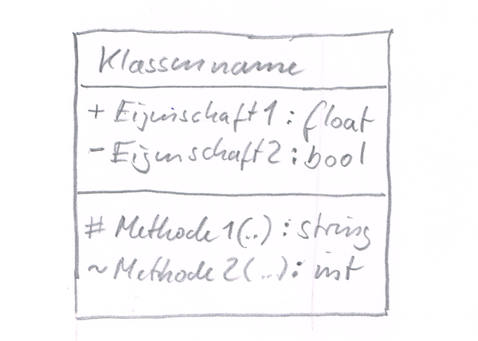  

Den Eigenschaften und Methoden können weitergehende Informationen angefügt werden. Im Beispiel
sind das die Datentypen (der Rückgabewerte) und die Sichtbarkeitsmodifikatoren. Bei letzteren 
gilt folgende Symbolik:  
`+` public  
`-` private  
`#` protected  
`~` package (entspricht `internal` in C#)  
Weiterhin können bei Bedarf Parameterlisten, Standardwerte oder Zusicherungen usw. angegeben werden.

### Interface
Ein Interface wird genauso notiert wie eine Klasse, lediglich über dem Klassennamen wird in doppelten 
spitzen Klammern ``<<interface>>`` dazu geschrieben.

### Beziehungen zwischen Klassen
In der Regel werden für ein Softwareprojekt viele verschiedene Klassen genutzt und implementiert, zwischen 
denen oder deren Objekten bestimmte Beziehungen existieren. 

#### Spezialisierung (Vererbung)
Eine Linie mit einer nicht ausgefüllten Pfeilspitze an einem Ende zeigt die Spezialisierung einer Subklasse 
in Bezug auf die Superklasse und damit eine Vererbungsbeziehung an.

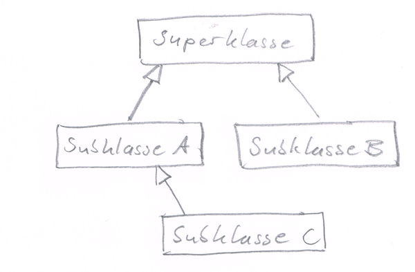

In Klassendiagrammen wird bei Vererbungsbeziehungen die Superklasse oft _oberhalb_ der Subklasse
gezeichnet, so dass die _erbt-von_-Pfeile nach oben zeigen.

#### Implementierung
Implementiert eine Klasse ein Interface, so wird dies wie bei der Spezialisierung mit einem Pfeil mit 
leerer Spitze angezeigt. Dieser ist auf das Interface gerichtet. Allerdings ist die Linie gestrichelt. 
Alternativ wird ein "Lolly" an die Klasse gezeichnet, der mit dem Namen des entsprechenden Interfaces 
versehen ist. Dies soll wie ein Stecker wirken.

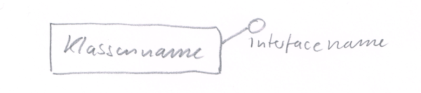

Da in vielen Programmierumgebungen eine Klasse zwar nur von _einer_ anderen Klasse erben kann, aber 
viele Interfaces implementieren kann, bietet diese Lolly-Darstellung eine kompaktere Darstellung für
Klassen, die mehrere Interfaces implementieren. 

#### Verwendung
Einer Klasse, die ein Interface verwendet, wird eine entsprechende Buchse angefügt.

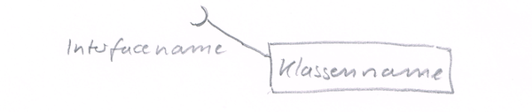

#### Allgemeine Assoziation
Eine allgemeine Beziehung zwischen Instanzen von Klassen wird mit einer simplen Verbindungslinie dargestellt. 
Allerdings können daran weitere Informationen notiert sein wie der Name der Assoziation, die Multiplizität 
(also ob es sich um eine 1:1-Beziehung, 1:n- oder n:m-Beziehung handelt), die Rollen usw.  

Im Beispiel sind Objekte der Klassen Prof (Professor\*in) und Studi (Student\*in) miteinander bezüglich der 
Thesis in Beziehung gesetzt. Der Assoziationsname lautet "schreibt bei". Die Zahlen und Bezeichnungen geben 
an, was das entsprechende Assoziationsende für das Gegenüber bedeutet und in welcher Anzahl es auftreten 
kann. Für Studi hat Prof die Rolle des Betreuers und hiervon kann es nur einen geben (Zweitbetreuer wird 
hier nicht betrachtet). Andersherum kann es 0 bis beliebig viele Studis für ein Prof geben, welche für ihn 
Betreute sind.  

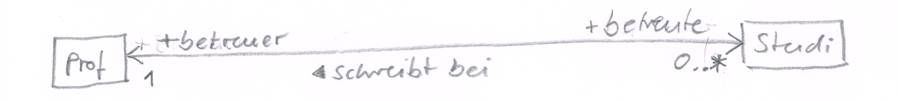

Die Pluszeichen geben die Sichtbarkeit an, die Information soll also public sein. Die Pfeilspitzen geben an, 
in welche Richtung "navigiert" werden kann. Im Beispiel kann von dem Objekt Studi leicht auf den 
assoziierten Prof zugegriffen werden. Bei der Implementation könnte Studi also möglicherweise ein Attribut 
vom Typ Prof mit der entsprechenden Referenz erhalten. Die Assoziation ist hier bidirektional, vom Objekt 
Prof kann also auch leicht zu den betreuten Studis navigiert werden. Hier bietet sich ggf. ein Array vom Typ 
Studi als Attribut der Prof-Klasse an.

#### Aggregation
Die Aggregation stellt eine "Teil-von" Beziehung dar. Sie wird durch eine leere Raute auf der Seite des 
Aggregators, also des Ganzen, dargestellt. Dieser setzt sich logisch zumindest zu einem gewissen Grade aus 
den Teilen auf der anderen Seite zusammen.  

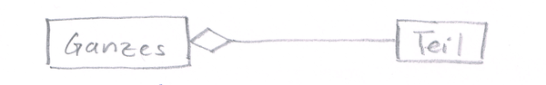  

#### Komposition
Während die Aggregation lediglich eine schwache Spezialisierung der allgemeinen Assoziation darstellt, ist 
die Komposition deutlich strenger. Die Raute wird hierbei ausgefüllt. Die assoziierten Teile können nur Teil 
genau eines Ganzen sein und werden vernichtet, wenn das Ganze vernichtet wird.  

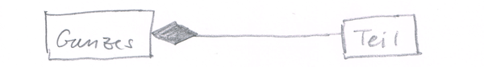  

## Klassen definieren und optimieren mit Hilfe folgender Fragen
* **Was ist es?** 		-> Ableitung, Superklasse, implementierte Interface  
  Ist es eine Spezialisierung einer bereits vorhandenen Klasse? Gibt es Gemeinsamkeiten verschiedener 
  Klassen, in Eigenschaft oder Verhalten, die man in einer Superklasse definieren kann? Soll das 
  Gesamtsystem durch Spezialisierungen erweiterbar sein, ohne dass eine solche Erweiterung die Änderung 
  bereits bestehenden Codes erforderlich macht?  
  Die Beantwortung dieser Fragen hilft beim Entwurf einer Klassenhierarchie.
* **Was hat es?** 		-> Eigenschaften, Membervariablen  
  Welche Eigenschaften hat ein Objekt der Klasse? Was zeichnet es aus? Welche davon sind nur für das Objekt 
  selbst wichtig, auf welche müssen andere zugreifen können. Von welchem Typ sind die Eigenschaften, welche 
  Werte können sie annehmen und unter welchen Umständen werden die Werte geändert?  
  Die Beantwortung dieser Fragen hilft beim Entwurf der Attribute und deren Sichtbarkeitsmodifikation.
* **Was kann es?** 		-> Methoden  
  Welche Verhaltensweisen weist ein Objekt der Klasse auf? Wie kann es sich oder seine "Umwelt" verändern? 
  Welchen Algorithmen folgt es?  
  Die Beantwortung dieser Fragen hilft beim Entwurf der Methoden.
* **Was weiß es?**		-> Verweise zu anderen Objekten  
  Welche Informationen benötigt das Objekt aus seiner "Umwelt" um funktionsfähig zu sein? Welche Referenzen 
  auf andere Objekte welcher Klassen werden dem Objekt zur Verfügung gestellt?  
  Die Beantwortung dieser Fragen hilft beim Entwurf der Assoziationen zwischen Objekten und der Parameterübergaben bei Methoden.
* **Wer verwaltet es?**	-> Erzeuger, Referenzierung  
  Wo und von wem wird das Objekt erzeugt? Wird es von einer zentralen Struktur dauerhaft referenziert? Werden an anderer Stelle dauerhafte Referenzen gespeichert?  
  Die Beantwortung dieser Fragen hilft beim Entwurf der Assoziationen zwischen Objekten, insbesondere von Aggregationen und Kompositionen, sowie eines stabilen Gesamtsystems. Die Darstellung wird auch im Aktivitätsdiagramm reflektiert.

> #### TODO
>
> - Zeichnet ein Klassendiagramm folgender Sachverhalte (_kennt_ = "Was weiß es"):
>   - Eine `Person` _hat_ einen Namen und ein Alter
>   - Ein `Teilnehmer` _ist_ eine Person
>     - Zusätzlich _hat_ jeder Teilnehmer eine Matrikelnummer
>     - Jeder Teilnehmer _kennt_ die Kurse, die er besucht
>   - Ein `Dozent` _ist_ eine Person
>     - Zusätzlich _hat_ jeder Dozent eine Raum-Angabe seines Büros und 
>       eine Sprechstunde (Wochentag und Uhrzeit)
>     - Jeder Dozent _kennt_ die Kurse, die er hält
>   - Ein `Kurs` _hat_ einen Titel, einen Wochentag und und eine Uhrzeit und eine Raum-Angabe
>     - jeder Kurs _kennt_ den Dozenten, der den Kurs hält
>     - jeder Kurs _kennt_ die Teilnehmer, die am Kurs teilnehmen
> 
> - Implementiert das Klassendiagramm in C#
>   - Es gibt mehrere Möglichkeiten, die _kennt_ Beziehungen zu implementieren. Welche
>     sind geeignet?
>
> - Erweitert das Klassendiagramm um folgende Sachverhalte
>   - Jeder Kurs _kann_ einen Infotext (was, wer, wann, wo) ausgeben
>   - Jeder Dozent _kann_ eine Liste der von ihm gehaltenen Kurse ausgeben 
>   - Jeder Dozent _kann_ eine Gesamtliste der aktuell bei ihm eingeschriebenen _Teilnehmer_ generieren
