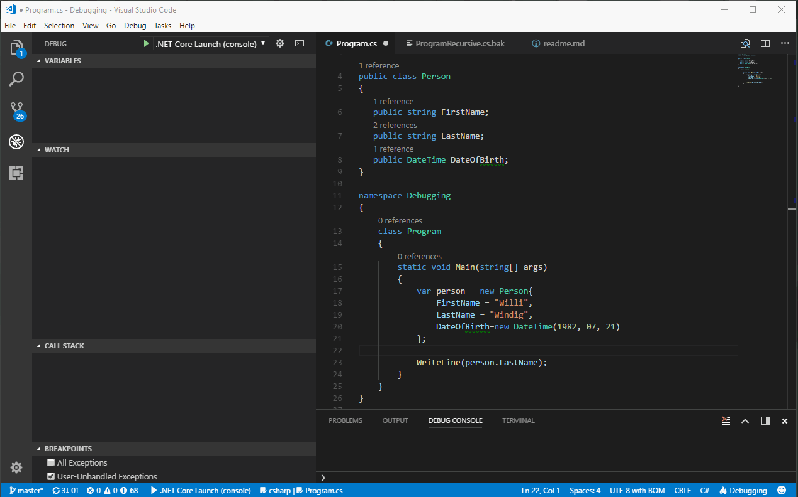

# Debugging

Der Begriff beschreibt zunächst ganz allgemein die Beseitigung von Fehlern im Programm-Code. Meistens sind hier 
allerdings Fehler gemeint, die erst zur Laufzeit eines Programms auftreten und weniger Syntax-Fehler, die -je 
nach Programmiersprache und Entwicklungsumgebung- schon zur Compile-Zeit erkannt und korrigiert werden
können.

Der Begriff **Bug** (für Insekt, Käfer, Schädling) ist im englischen Sprachraum unter Ingenieuren bereits 
seit vor der Erfindung des Computers als Bezeichnung für eine Fehlfunktion im Gebrauch. Bei Arbeiten an einem
frühen Computer 1947 verursachte tatsächlich eine Motte eine Fehlfunktion. Damit war die Grundlage des 
Begriffs *Bug* als Computerfehler gelegt.

Im Umfeld der Software-Entwicklung beschreibt **Debugging** den Prozess, einer Fehlfunktion auf die Spur zu kommen, so dass der Fehler
behoben werden kann. Um dies zu bewerkstelligen, muss ein Programmierer dem Programm beim Arbeiten zusehen können.
Dies umfasst, folgende Möglichkeiten:

- Die Inhalte von Variablen, Parametern und Objekt-Eigenschaften müssen eingesehen werden können. 
- Der Verlauf des Kontrollflusses muss nachvollzogen werden können, also z.B.
    - Wird in einer `if`-Anweisung der `if` oder der `else`-Zweig ausgeführt?
    - Wie oft wird eine Schleife durchlaufen?
    - Welche Methode ruft welche andere Methode mit welchen Parametern auf.

## printf-Debugging

Die einfachste Möglichkeit für Software-Entwickler, an oben beschriebene Informationen zu kommen, ist es, zur Laufzeit#
eines Programms Text-Ausgaben zu erzeugen. In den meisten Umgebungen können Textausgaben auf einer
Kommandozeile (engl. *Console*) ausgegeben werden. Dafür existieren in unterschiedlichen Umgebungen
unterschiedliche Befehle, z.B.

- C#: `System.Console.WriteLine("Hallo");`
- JavaScript/TypeScript: `console.log("Hallo");`
- Java: `System.out.println("Hallo");`
- Processing: `println("Hallo");`
- C/C++ `printf("Hallo");`

Aus dem Namen des Konsolen-Ausgabe-Befehls aus  C/C++ - `printf` für _print formatted_ - entwickelte 
sich der Begriff _printf-Debugging_ für die hier beschriebene Vorgehensweise.

### Variableninhalte

In C# können viele Variableninhalte einfach direkt in der `WriteLine` Anweisung ausgegeben werden, wie z.B.:

```C#
using System;   // damit kann direkt Console.WriteLine() aufgerufen werden (ohne System)
...
int i = 42; 
Console.WriteLine(i);
```

Zudem gibt es mehrere Möglichkeiten, Variableninhalte in Ausgabe-Strings einzusetzen. Zum einen
mit `+` als 
[String-Verkettungs-Operator](https://docs.microsoft.com/de-de/dotnet/csharp/programming-guide/strings/how-to-concatenate-multiple-strings), 
oder mit einem sogenannten 
[*interpolierten* String](https://docs.microsoft.com/de-de/dotnet/csharp/language-reference/keywords/interpolated-strings),
erkennbar am `$`-Zeichen.

```C#
using static System.Console;   // damit kann sogar NUR WriteLine() aufgerufen werden (ohne System.Console)
...
float f = 3.1415; 
WriteLine("Der Inhalt von f ist: " + f + "."); // String-Verkettung mit + 
WriteLine($"Der Inhalt von f ist: {f}.");      // String-Interpolation mit $ und {}
```

In allen oben angegebenen Fällen wird der Variableninhalt vom jeweiligen Datentyp 
(`int` bei `i`, `float` bei `f`) in einen String umgewandelt. Dazu wird die 
Methode `ToString()` aufgerufen, die in C# für ALLE Datentypen implementiert ist.

> #### TODO
>
> Findet heraus, was die Methode `ToString()` bei Arrays, Listen und selbst definierten 
> Datentypen (wie z.B. Klassen) macht.

Wie o.s. **TODO** zeigt, ist die automatisch eingebaute Variante von `ToString()` bei selbst
implementierten Klassen nicht besonders aussagekräftig. Daher ist es möglich, für jede 
selbst implementierte Klasse auch eine eigene Version von `ToString()` beizulegen, die 
für Instanzen dieser Klasse dann eine aussagekräftige Ausgabe erzeugt. 

> #### TODO
>
> - Erzeugt für folgende Klasse `Person` eine eigene `ToString()` Methode. Erzeugt eine Test-Routine,
>   in einem Array fünf Instanzen von `Person` erzeugt und in einer Schleife 
>   alle Personen auf der Konsole ausgibt, die älter als 20 sind.
>
> ```C#
> public class Person
> {
>    public string FirstName;
>    public string LastName;
>    public DateTime Age;
>
>    public override string ToString() { /* TODO */ }
> }
> ```

### Kontrollfluss

Um mit Hilfe von printf-Debugging den Programmverlauf nachzuvollziehen, genügt es, 
`WriteLine`-Ausgaben in Schleifenrümpfe, `if`- oder `else`-Zweige einzusetzen und
die Ausgabe zu verfolgen.

## Der Debugger

Um Fehlern in komplexerem Code auf die Spur zu kommen, kann Debugging über die Konsolen-Ausgabe
mühselig und unhandlich werden. Oft ist Debugging ein iterativer Prozess:

1. Es gibt eine Idee, wo der Fehler liegen kann und welche Ursache er haben könnte. 
2. Auf Grund der Annahme werden `WriteLine` Anweisungen in den Code eingefügt, um den Verdacht
   zu untermauern.
3. Die Ausgaben werden analysiert: Ggf. erhärtet sich der Verdacht, muss aber weiter eingegrenzt werden,
   oder der Verdacht wurde wiederlegt und es muss an anderer Stelle weiter gesucht werden.
4. Die Fehlersuche beginnt wieder bei Schritt 1 mit anderen Annahmen.

Jeder Iterations-Durchlauf der o.g. Schritte erfordert es, das laufende Programm zu stoppen, neuen 
`WriteLine()`-Code einzufügen, das Programm erneut zu compilieren, zu starten und ggf. wieder den 
Fehler zu provozieren.

Um diesen Iterationsprozess zu beschleunigen, bietet fast jede Entwicklungsumgebung mit dem so 
genannten *Debugger* ein Werkzeug an, das mindestens folgende Tätigkeiten unterstützt:

- Anhalten des Programmlaufs an beliebiger Stelle im Source-Code
- Schritt-für-Schritt-Durchlaufen von Programm-Code
- Anzeigen der Inhalte von Variablen, Parametern und Objekt-Bestandteilen

### Debugger starten und Breakpoint setzen

In Visual Studio Code können C# Programme über den eingebauten Debug-Mechanismus verfolgt werden. 
Der folgende Screen-Cast zeigt dabei die wichtigsten Schritte.


1. In der [*Activity Bar*](https://code.visualstudio.com/docs/getstarted/userinterface)
   wird in die Debug-Ansicht gewechselt ("Käfer verboten"-Icon).
2. In einer Code-Zeile wird ein so genannter ***Breakpoint*** gesetzt (roter Punkt). Dort hält 
   der Debugger nach dem Starten des Programms die Ausführung an.
3. Über den ***Start Debugging*** Befehl (grüner Pfeil oben links) wird der Debugger gestartet.
4. Das Programm startet und hält am Breakpoint an (gelber Pfeil vor der Codezeile). **Wichtig**: Das Programm
   stoppt *vor* dem Breakpoint. Die Codezeile, in der der Breakpoint steht, wurde *noch nicht* ausgeführt.
5. Die aktuelle Code-Zeile wird mit dem ***Step Over*** Befehl aus der 
   [*Debug actions pane*](https://code.visualstudio.com/docs/editor/debugging#_debug-actions)
   ausgeführt. Der Programmfluss wird *vor* der nächsten Zeile automatisch wieder angehalten
   (gelber Pfeil vor der nächsten Zeile).
6. Die nächste Zeile mit der `WriteLine`-Anweisung wird ausgeführt und das Ergebnis dieser Zeile ist direkt im
   Ausgabe-Panel sichtbar.

> #### TODO
> 
> - Untersucht die weiteren Befehle der 
>   [Debug actions pane](https://code.visualstudio.com/docs/editor/debugging#_debug-actions).
>   Was passiert, wenn einer der anderen Buttons gedrückt wird?
> - Recherchiert im Internet, wozu die anderen Buttons gut sind und erklärt euch, in welchen
>   Situationen diese nützlich sein könnten.

### Variableninhalte

Um die Inhalte von Variablen, Parametern oder Objektbestandteilen ansehen zu können, gibt es
in VS Code zwei Möglichkeiten:

- Watch-on-Mouse-Over
- Lokale Variablen
- Das Watch-Fenster

#### Ad-Hoc-Watch mit der Maus

Wird bei gestopptem Debugger die Maus über einen Ausdruck im Source-Code gehalten, der einen
evaluierbaren Wert im aktuellen Kontext erzeugt, wird dieser in einem kleinen Pop-Up-Fenster 
neben der Maus angezeigt.

> #### TODO
>
> - Stoppt den Debugger nach dem Anlegen mehrerer Personen und haltet die Maus über verschiedene
>   Identifizierer oder Variablennamen. 
> - Probiert aus, was passiert, wenn ein ganzer Ausdruck wie z.B. `person.FirstName` markiert wird.
>

#### Das Watch-Fenster

Der Inhalt von sämtlichen lokalen Variablen im Kontext der aktuellen Codezeile wird im 
***Variables** Fenster des Debuggers (oben links) angezeigt. Ggf. muss die Liste der 
Variablen ausgeklappt werden. 


#### Das Watch-Fenster

Soll der Inhalt einer Variablen dauerhaft angezeigt werden, z.B. während mit Step-Over die Zeilen 
eines Stück Source-Code verfolgt werden, kann dies im Watch-Fenster der Debug-Ansicht (links)
eingetragen werden.

Darüber hinaus können hier beliebige C#-Ausdrücke eingetragen werden, die dann wie ganz normaler
Programmcode evaluiert werden. Somit lassen sich zu überprüfende Bedingungen sehr gut abprüfen,
ohne dass dazu entsprechender Debug-Code im Source-Code-File untergebracht und das Projekt neu
compiliert werden muss.

Im Folgenden Screencast sieht man, neben der Verwendung des Mouse-Over-Watch und der Verwendung
des Watch-Fensters für einfache Variablen-Inhalte, wie überprüft wird, ob für den Inhalt
einer Variablen vom Typ `Person` gilt, ob die Person nach dem 1. Januar 1980 geboren wurde.



Wenn ihr die Debugger-Watch-Funktionalität mit eurem eigenen Code aus dem ersten **TODO** ausprobiert,
seht ihr, wie die Variableninhalte von Objekten gleich mit dem, was eure `ToString()`-Methode 
liefert, angezeigt werden. Es lohnt sich also nicht nur für das printf-Debugging, eigenen
Datentypen eine eigene `ToString()`-Methode zu verpassen.

### Der Call-Stack

In komplexen Programmabläufen kann es sein, dass nicht ganz klar ist, wie die Aufrufreihenfolge
zustande kam, bis an einem bestimmten Breakpoint angehalten wurde. Beispiel:
- Die `Main`-Methode ruft `Methode1` auf,
- `Methode1` ruft `Methode2` auf,
- `Methode2` ruft `Methode3` auf.

Würde nun in `Methode3` ein Breakpoint gesetzt, würde der Call Stack (das Fenster unter dem 
Watch-Fenster) diese Aufrufliste erscheinen. So lange die Aufrufe zur Compile-Zeit fest stehen,
ist die Frage zulässig, wozu das nützt. Oft entsteht eine konkrete Reihenfolge der Methodenaufrufe
aber erst zur Laufzeit, z.B. weil Methoden in `if` oder `else`-Zweigen, oder innerhalb von
Schleifenrümpfen aufgerufen werden, oder weil durch Polymorphie erst zur Laufzeit entschieden wird,
welche Variante einer Methode aufgerufen wird.

Neben der reinen Darstellung der Reihenfolge der Aufrufe kann durch Doppelklick auf einen Eintrag
im Call-Stack zudem der Debugger in den Kontext des Aufrufs versetzt werden. D.h. es wird angezeigt,
wo der nächst tiefere Aufruf stattfindet und es können die Inhalte aller Variablen, Parameter und 
Objekt-Bestandteile angesehen werden. Genauso können beliebige Ausdrücke, die im jeweiligen Kontext 
zulässig sind, im Watch-Fenster abgeprüft werden.

> #### TODO
>
> - Schreibt Beispielcode, in dem eine innere Methode unter einer bestimmten Bedingung aus einer
>   äußeren Methode aufgerufen wird.
> - Setzt einen Breakpoint in der inneren Methode und startet den Debugger
> - Betrachtet den Call-Stack und doppelklickt auf die äußere Methode.
> - Schaut Euch Variableninhalte und Ausdrücke im Kontext der äußeren Methode im Watch-Fenster an.
>

### Erweiterte Funktionalität von Debuggern

#### Conditional Breakpoints

Im Inneren von Schleifen oder bei rekursiven Aufrufen kann es vorkommen, dass eine zu debuggende
Codezeile mehrfach durchlaufen wird, bevor der eigentliche Fehlerfall auftritt. Dann kann es unhandlich
oder unmöglich sein, den Fehler im Debugger zu verfolgen. Beispiel: Erst beim 100'000 Durchlauf einer Code-Zeile
tritt ein Fehler erstmals auf. 

In diesem Fall können ***Conditional Breakpoints*** helfen. Hier kann an jedem Breakpoint ein zusätzlicher
Ausdruck angegeben werden, der einen `bool`'schen Wert evaluiert (dessen Ergebnis also `true` oder `false`)
ist. Läuft das Programm im Debugger, wird der Programmfluss nur dann am Breakpoint anhalten, wenn die 
angegebene Bedingung (`true`) ergibt. Statt einer beliebigen Bedingung kann auch ein ***Hit Count*** angegeben
werden. In diesem Fall führt der Debugger selbständig Buch, wie oft ein Breakpoint bereits durchlaufen wurde.
Erst wenn der angegebene Hit Count erreicht wurde, stoppt die Ausführung.

In Visual Studio Code kann jeder beliebige Breakpoint (roter Punkt) zu einem Conditional Breakpoint gemacht werden, 
indem auf dem Breakpoint mit der rechten Maustaste geklickt wird, der Menüpunkt "Edit Breakpoint" gewählt wird
und dann ein Bedingung (*Expression*) oder ein *Hit Count* eingegeben wird. Conditional Breakpoints werden
durch ein zusätzliches `=` Symbol im roten Punkt markiert.

> #### TODO
>
> - Setzt einen Conditional-Breakpoint im Schleifenrumpf der Schleife aus dem ersten [**TODO**](#todo-1).
>   - Gebt einen Hit-Count an und überzeugt euch, dass der Programmfluss erst nach entsprechenden Anzahl
>     an Durchläufen stoppt.
>   - Gebt eine Bedingung an (z.B. der Vorname der gerade behandelten Person muss einem bestimmten Kriterium genügen)
>

#### Ändern von Variablen-Inhalten während des Debugging

Um Fehlern auf die Spur zu kommen, ist es manchmal ist es wünschenswert an einer bestimmten Stelle von 
Hand den Inhalt einer Variablen, eines Parameters o.ä. zu ändern und dann im Debugger schrittweise weiter
verfolgen, wie sich der Code verhält. In VS-Code kann der Variableninhalt von einfachen Datentypen, bzw.
die Inhalte von Objekten, die einfache Datentypen sind, über das *Variables*-Fenster verändert werden.

Dazu kann einfach auf den aktuellen Inhalt doppelgeklickt werden und der Inhalt abgeändert werden.

> #### TODO
>
> - Setzt einen Breakpoint im Schleifenrumpf der Schleife aus dem ersten [**TODO**](#todo-1). 
> - Verändert den Vornamen des aktuellen `Person` Objektes.
> - Überzeugt Euch durch Inspektion des Listen (bzw. Array)-Inhaltes, dass tatsächlich der
>   Listen-Inhalte überschrieben wurde.
> - Für Fortgeschrittene: Warum kann nicht so einfach beim Debuggen das Geburtsdatum z.B. über 
>   die Änderung des im Variable-Fenster angezeigten Geburtsjahres verändert werden? Wie funktioniert
>   es dennoch? Tipp: Im Debugger ausprobieren und die 
>   [Referenzdoku](https://msdn.microsoft.com/de-de/library/system.datetime(v=vs.110).aspx)
>   und den [Source-Code](http://referencesource.microsoft.com/mscorlib/system/datetime.cs.html) von 
>   `DateTime` ansehen. In welcher der vielen Eigenschaften sind überhaupt die eigentlichen Datums-Daten codiert?
>   

#### Verändern des Programmflusses während des Debugging (Set next Statement)

In vielen Debuggern kann experimentell die nächste auszuführende Anweisung verändert werden.
In VS Code mit C# derzeit nicht möglich.

#### Remote-Debugging 

In vielen Debuggern können der zu debuggende Prozess und der Debugger mit dem Source-Code auf unterschiedlichen
Rechnern laufen. So werden z.B. native Android- oder iOS-Apps gedebuggt: Die Entwicklungsumgebung mit 
Source-Editor und Debugger läuft auf einem Windows- oder MacOS-Rechner und am USB-Kabel angeschlossen ist 
ein iOS oder Android-Devive auf dem die zu debuggende App läuft. In VS Code mit C# derzeit nicht möglich.

#### Historisches Debugging

Um Fehlern auf die Spur zu kommen, die z.B auf einem Kundenrechner aufgetreten sind, können in einigen 
Entwicklungsumgebungen abgestürzte Programme noch den gesamten Debug-Kontext in eine Datei schreiben. Mit
Hilfe dieser Datei kann dann zu einem anderen Zeitpunkt auf einem Entwicklungsrechner mit den üblichen Debug-
Werkzeugen die Absturzursache analysiert werden. In VS Code mit C# derzeit nicht möglich.

## Debugger vs. Printf

> #### TODO
> 
> - Erörtert Vorteile und Nachteile printf-Debugging vs. Debugger.
> - Wie passt Logging hier hinein
> - Wie können zeitabhängige Sachverhalte, z.B. in der Render-Schleife eines Game
>   gedebuggt werden?


## Übungsaufgabe

Betrachtet die Source-Code-Dateien 
[FamilyTree.cs](FamilyTree.cs) und 
[Program.cs](Program.cs). In Familytree wird eine Datenstruktur aufgebaut,
die eine Art Familienstammbaum repräsentiert (Ähnlichkeiten mit realen Personen sind rein zufällig :-)).

Macht euch klar, dass die Datenstruktur `Person` rekursiv ist, denn jedes Objekt vom Typ `Person` referenziert
zwei weitere Objekte vom Typ `Person`, nämlich `Mom` und `Dad`. 

Die Methdode `BuildTree()` baut einen Beispiel-Baum auf. Setzt einen Breakpoint in [Zeile 19 von Program.cs](Program.cs#L19),
startet den Debugger und seht Euch den Inhalt von `root` im Debugger an.

Die Methode `Find()` durchläuft rekursiv den Baum und prüft alle `Person`-Objekte darauf, ob die Bedingung in 
[Zeile 22](FamilyTree.cs#L22) gegeben ist. Die erste `Person`, die die Bedingung erfüllt, wird zurückgeliefert.

Ändert die Bedingung so, dass nicht gleich die erste Person ("Willi") zurückgegeben wird. Eventuell gibt es Abstürze.
Analysiert die Abstürze mit dem Debugger, überprüft Variableninhalte und den Call-Stack.

Schreibt komplexere Bedingungen, findet z.B. die erste Person, die in einer Altersspanne liegt, vergleicht dazu person.DateOfBirth.Year
mit DateTime.Now.Year. Analysiert mit dem Debugger, ob Eure Bedingung richtig ist. 


