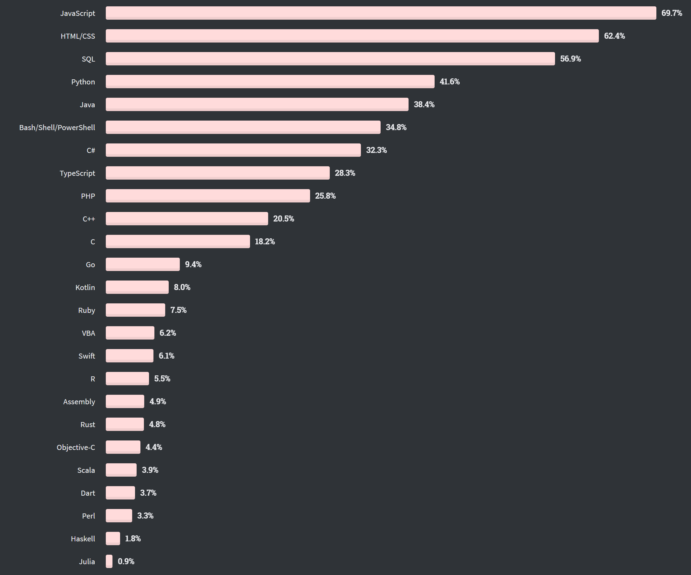

# Programmierung Allgemein

## Einführung

Programmiersprachen in 2020:


Akutelle Version
[Quelle: Stack Overflow Developer Survey 2021](https://insights.stackoverflow.com/survey/2021)

### FRAGEN

1. Wieso sollte man in unserer heutigen Zeit Programmieren lernen?
2. Wieso habt ihr euch dazu entschlossen, euer Studium in diesem Bereich zu absolvieren?
3. Was denkt ihr was erwartet euch in Zukunft noch?

## Programmierparadigmen

Ein Programmierparadigma beschreibt den grundlegenden Stil, in dem ein Programm entworfen wird. Es gibt vor, welche Prinzipien angewandt und welche Herangehensweisen genutzt werden.

Einer Programmierung liegen je nach Struktur und Grundlage der einzelnen Programmiersprache verschiedene Prinzipien zugrunde. Diese unterstützen den Developer bei der Erstellung von "gutem Code", in wenigen Fällen wird damit sogar bestimmt in welcher Herangehensweise Probleme zu lösen sind.

Die Programmierparadigmen unterscheiden sich durch Ihre Konzepte für die Repräsentation von statischen (bspw. Konstanten, Variablen, Methoden, Objekten) und dynamischen (wie beispielsweise Zuweisungen, Kontrollfluss, Datenfluss) Elementen.

Es ist möglich, dass eine Programmiersprache mehrere Paradigmen gleichzeitig unterstützt. Das bedeutet mit einer Programmiersprache kann ein Developer in mehreren Programmierparadigmen arbeiten und muss so nicht im gesamten Source Code am immer gleichen Paradigma festhalten. Sondern kann im Einzelfall entscheiden, welche Vorgehensweise die beste Option ist.

### FRAGE

_Welche Programmierparadigmen kennt ihr?_

### Programmierparadigmen

- Imperative Programmierung
  - Strukturierte Programmierung
  - Prozedurale Programmierung
  - Modulare Programmierung
  - Programmierung mit abstrakten Datentypen
- Deklarative Programmierung
  - Funktionale Programmierung
  - Logische Programmierung
  - Constraintprogrammierung
- Objektorientierte Programmierung


## Imperative Programmierung / Prozedurale Programmierung

Die Bezeichung leitet sich vom lateinischen "imperare" (anordnen, befehlen) ab, das bedeutet in der imperativen Programmierung besteht ein Programm aus einer Abfolge von Befehlen, die vorgeben, in welcher Reihenfolge etwas getan werden soll.

Im Gegensatz zur deklarativen Programmierung liegt hierbei der Fokus auf dem _WIE_, der Lösungsweg steht im Vordergrund.

Programmiersprachen, welches dieses Paradigmen unterstützen:
- Ada
- Algol
- C und C++
- C#
- COBOL (ab COBOL 85)
- Fortran (ab Fortran 77)
- Java
- Pascal, Modula-2, Oberon und Component Pascal
- Python
- Visual Basic
- Go (Programmiersprache)

### Strukturierte Programmierung

Dieses Paradigma behinhaltet zum einen die baumartige Zerlegung eines Programms in Teilprogramme, welches in der Prozeduralen Programmierung angewendet wird. Hierbei werden die Programme in kleinere Teilaufgaben aufgespalten, Prozeduren genannt.
Zum zweiten beschränkt der Ansatz auf unterster Ebene die Programmierung auf drei Kontrollstrukturen:

- Sequenz (Methoden / Funktionen, welche hintereinander ausgeführt werden)
- Auswahl / Selektion (Verzweigung IF / SWITCH)
- Wiederholung / Iteration (Schleifen)

Dabei wird ein standardisierter Einsatz der Sprunganweisung des GOTO, vermieden bzw. eingeschränkt. Dabei speichert sich das Programm einen inneren Zustand, welcher dann zur Laufzeit für alle Programmteile verfügbar ist. Häufig wird bei großen Programmen in diesem Paradigmen abfällig vom Spaghetti Code gesprochen.

Jedoch kann durch die konsequente Implementierung von Teilprogrammen mit lokaler Sichtbarkeit von Identifikatoren und Kontrollstrukturen eine Codewiederholung vermieden werden.
Das heißt ein Teilprogramm darf sich tatsächlich nur um einen einzigen Teil des Programms kümmern, so dass dieser von anderen Funktionen wiederverwendet werden kann.
Die Objektorientierte Programmierung baut auf der strukturierten Programmierung auf und erweitert bzw. ergänzt diese.

## Deklarative Programmierung / Funktionale Programmierung

Die deklarative Programmierung behandelt nicht wie bei der imperativen Programmierung das _WIE_ sondern das _WAS_; was soll später als Ergebnis erscheinen? Es wird also nicht mehr der Lösungsweg programmiert, sondern nur noch angegeben, welches Ergebnis gewünscht ist. Zu diesem Zweck beruhen deklarative Paradigmen auf mathematischen, rechnerunabhängigen Theorien.

Die deklarativen Programmiersprachen erfreuen sich nicht sehr großer Akzeptanz, da es sich hierbei meist im Akademikersprachen handelt und ihre Strukturen sehr komplex aufgebaut sind:

```Haskell
quicksort [] = []
quicksort (x:xs) = quicksort [n | n<-xs, n<x] ++ [x] ++ quicksort [n | n<-xs, n>=x]
```

**Obiges Beispiel:** Haskell ist eine typische deklarative Programmiersprache. Der Programmierer beschreibt, was das Programm mit einer Eingabe macht, also wie mit welcher Eingabe umzugehen ist, wobei der Berechnungsablauf nicht von Interesse ist. Die Berechnungen erfolgen dann durch Wertemanipulation. Hauptkontrollstruktur bildet die Rekursion, insbesondere - aus Effizienzgründen - die Endrekursion.

Zu den deklarativen Programmiersprachen gehören:

- funktionale Sprachen (Lisp, ML, Miranda, Gofer, Haskell, F#, Scala)
- logische Sprachen (Prolog)
- funktional-logische Sprachen (Babel, Escher, Curry, Oz)
- mengen-orientierte Abfragesprachen (SQL)

### Funktionale Programmierung

Bei der funktionalen Programmierung stehen "Funktionen" bzw. "Methoden" im Vordergrund, hierbei werden diese nicht nur definiert und angewendet, sondern sie bestimmen auch wie Daten miteinander verknüpft, als Parameter verwendet und als Funktionsergebnisse auftreten können.

Die funktionale Programmierung entspringt der mathematischen Grundlagenforschung. In den 1930er Jahren entwickelte Alonzo Church den Lambda-Kalkül als Instrument, um das Entscheidungsproblem zu bearbeiten und dazu den Begriff der berechenbaren Funktion zu definieren. Der Lambda-Kalkül selbst beschäftigt sich nicht mit bestimmten Funktionen, sondern ist nur ein Regelwerk dafür, wie die Anwendung von Funktionen auf ihre Argumente erfolgt und wie dabei mit freien und gebundenen Variablen verfahren wird.

Die besonderen Eigenschaften der funktionalen Programmierung ermöglichen es, auf die in der imperativen Programmierung benötigten inneren Zustände eines Berechnungsprozesses ebenso zu verzichten wie auf die zugehörigen Zustandsänderungen, die auch Seiteneffekte genannt werden. Der Verzicht darauf vereinfacht auf der einen Seite die semantische Analyse eines Computerprogramms erheblich und eröffnet auf der anderen Seite weitreichende Möglichkeiten zur regelbasierten, algebraischen Programmtransformation und -synthese. Daraus ergibt sich die erhebliche praktische Bedeutung der funktionalen Programmierung für die Informatik.

Eine weitere Konsequenz ist, dass es in funktionaler Programmierung besonders einfach ist, Algorithmen ohne Berücksichtigung der Beschaffenheit der bearbeiteten Datenobjekte zu beschreiben und dadurch generischen Programmcode zu erstellen. Viele funktionale Verfahren sind so generisch, dass sie seit den 1950er Jahren keiner Anpassung unterworfen werden mussten.

**Die funktionale Programmierung ist durch folgende Eigenschaften gekennzeichnet:**

1. Computerprogramme werden als Funktionen verstanden, die für eine Eingabe eine Ausgabe liefern, die nur von dieser abhängig ist.
2. Funktionen werden nicht als Abfolge von Anweisungen dargestellt, sondern als ineinander verschachtelte Funktionsaufrufe.
3. Funktionen sind gegenüber allen anderen Datenobjekten gleichberechtigt. Das bedeutet, dass sie als Parameter in Funktionen eingehen dürfen und ebenso als Berechnungsergebnisse aus Funktionen hervorgehen können. Insbesondere können Funktionen wie andere Datenobjekte zur Laufzeit erstellt werden oder entfallen.
4. Eine Funktion kann auf Variablen Bezug nehmen, die dem Kontext angehören, in dem ihre Erstellung erfolgt ist. Dies kann sie auch dann noch tun, wenn sie den Kontext verlassen hat. Die Belegung der Variablen zum Zeitpunkt des Verlassens dieses Kontextes wird dann innerhalb dieser Funktion eingefroren. Eine so entstandene Funktion heißt Closure und die eingefrorenen Variablenbelegungen heißen Closure-Variablen.
5. Funktionsdefinitionen können ohne explizite Namensgebung literal in der Stellung eines Funktionssymbols verwendet werden. Solche Funktionen heißen anonym und werden oft salopp „Lambdas“ genannt.

## Objektorientierte Programmierung

### AUFGABE

**_Schließt euch in kleinere Gruppen maximal 4 Personen zusammen und erörtert gemeinsam, die Grundstrukturen und Eigenschaften der Objektorientierten Programmierung (20 Minuten), Ergebnisse gerne als MindMap oder ähnliches visuelles Diagramm_**

### Einführung

Die Grundidee der objektorientierten Programmierung ist die Abstraktion der Realität in Programmcode, als Entwickler möchte ich die realen äußeren Bedingungen in meine Software einbeziehen und diese umsetzen. 

Für die Einbeziehung der realen Bedingungen erfordert die Denkweise weitere Konzepte, Klassen, Vererbung, Polymorphie und Assoziationen. Dafür gibt es innerhalb der Entwurfsphase ein Diagramm, welches verwendet werden kann, das Klassendiagramm. Hierbei wird versucht die auftretenden Objekte und Abstraktionen darzustellen und so ein Bild über das reale Verhältnis herzustellen.

### Konzepte der OOP

- **Die Abstraktion:** Jedes beteiligte Teil in einem System kann als Abstraktion verstanden werden, dieses Objekt kann über Methoden aufrufen, Zustände weitergeben und ändern, mit anderen Objekten kommunizieren.
  - **Klasse:** Ein Klasse stellt über seine Attribute eine Datenstruktur dar, welche in der Realität ebenso vorzufinden ist. _Beispiel:_ Eine Person (Klasse) hat mindestens einen Namen und ein Geburtsdatum (Attribute). Das Verhalten einer Klasse wird dann über Funktionen / Methoden dargestellt. _Beispiel:_ Eine Person kann ihren Namen sagen (Funktion).

- **Datenkapselung:** Unter der Datenkapselung versteht sich das Veröffentlichen bzw. das Verbergen bestimmter Implementierungsdetails. Es steuert, ob Attribute bzw. Funktionen für alle außerhalb des instanzierten Objekts sichtbar sind. Stichworte an dieser Stelle: _private, public, protected, package_

- **Persistenz:** Die Persistenz beschreibt in der Informatik die Fähigkeit, Daten oder deren Verbindungen über einen längeren Zeitraum zu speichern, wofür ein nichtflüchtiges Speichermedium benötigt wird. In der Objektorientierung beschreibt die Persistenz, die Verfügbarkeit eines Objekts zur Laufzeit des Softwareprogramms. Das bedeutet Objekte und deren Variablen sind solange verfügbar wie das Programm läuft oder für das Objekt der Destruktor der instanzierten Klasse aufgerufen wird.

- **Vererbung:** Die Vererbung dient dazu, aufbauend auf existierenden Klassen neue zu schaffen, wobei die Beziehung zwischen ursprünglicher und neuer Klasse dauerhaft ist. Eine neue Klasse kann dabei eine Erweiterung oder eine Einschränkung der ursprünglichen Klasse sein. Neben diesem konstruktiven Aspekt dient Vererbung auch der Dokumentation von Ähnlichkeiten zwischen Klassen, was insbesondere in den frühen Phasen des Softwareentwurfs von Bedeutung ist. Auf der Vererbung basierende Klassenhierarchien spiegeln strukturelle und verhaltensbezogene Ähnlichkeiten der Klassen wider.

- **Polymorphie:** Mit der Polymorphie ist die Fähigkeit der Veränderung von abgeleiteten Eigenschaften einer Klasse gemeint. Erbt eine Klasse bzw. Objekt, Methoden oder Attribute von anderen Klassen bzw. Objekten, gibt es die Möglichkeit, diese nach Belieben zu modifizieren. So kann jede Klasse bzw. Objekt Methoden bzw. Attribute, welche vererbt wurden, auf den entsprechenden Anwendungsfall spezifizieren. Hierbei ist die Rede vom sogenannten Overriding, welches eine Ad-hoc-Polymorphie darstellt.