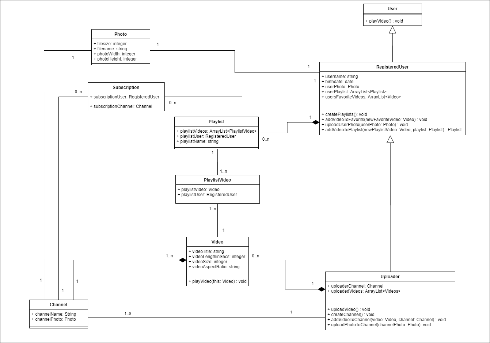

Hallo zusammen,

anbei findet Ihr die E-Mail von einem guten Freund von euch, der eure Hilfe braucht bei einem Projekt, was ein Freund und er zusammen verfolgen.

Das von euch entworfene Klassendiagramm für YourClips, wurde jetzt von einem Datenbank Entwickler überprüft und modifiziert, dass die Datenbank umgesetzt werden kann.
Nun sollt ihr das Klassendiagramm in SourceCode umsetzen.

Entsprechend mit Klassen, Attributen, Methoden und Assoziationen dazu.

VG Chris

________________________________________________________________

Hey,

danke für dein Klassendiagramm, wir haben das dem Cristo Feig gezeigt, weißt der Datenbank Entwickler.
Er meinte es sieht schon gut aus, hat für die Datenbank Implementierung, aber noch weitere Sachen ergänzt.

Wir würden das jetzt gerne mal als Programmcode so umsetzen.
Was du noch prüfen müsstest wären die Verbindungen zu einander, ob die so passen und ob die Sichtbarkeit für die Attribute und Methoden so immer passen.
An der Stelle war er sich jetzt nicht ganz sicher.

Ich habe kurz drauf geschaut, er hat jetzt weder Konstruktor, noch Getter und Setter Methoden für die Attribute mit aufgeführt.
Die sollten allerdings auf jeden Fall in den Programmcode mit einfließen.

Wäre cool, wenn du das mal für uns so umsetzen könntest.
Danke vielmals für deine Hilfe.

Achja, was ich nicht ganz verstanden habe war, jede Instanz einer Klasse sollte auch eine eindeutige UUID haben, welche von der Datenbank dann vergeben wird.
Er meinte das erklärt sich aber von selbst, dass ein jedes Objekt sowas haben sollte, naja du machst das schon.

Viele Grüße 
Steve Hurley und Chad Chen

