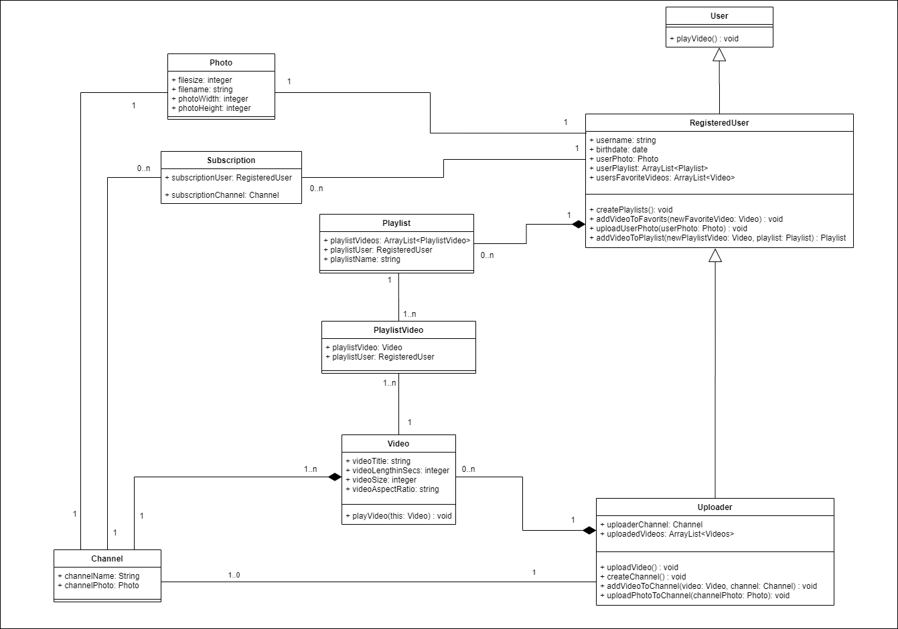

Hallo zusammen,

anbei findet Ihr die E-Mail von einem guten Freund von euch, der eure Hilfe braucht bei einem Projekt, was ein Freund und er zusammen verfolgen.

Als Grundlage dient das Klassendiagramm von letzter Übung:

Bild:

DrawIO-Datei:
[DrawIO-Datei](../../L04_CleanCode/tasks/img/classdiagramm_solution_chapter03.drawio)

Wenn ein Benutzer kein Bild hinterlegt hat, dann wird momentan offensichtlich ein Fehler geworfen, dass kein Bild gefunden wurde.
Solche Fehler lassen sich meist mit dem DesignPattern Null Object beheben, in dem einfach ein Default zurückgegeben wird.
Dazu dient euch folgender Link als Unterstützung:
[NullObjectPattern](https://www.tutorialspoint.com/design_pattern/null_object_pattern.htm)

Bitte entsprechend das Klassendiagramm erweitern und den Programmcode für die Klassen erstellen, so dass ein NullObject erzeugt wird, wenn kein Bild vorhanden zu sein scheint.

VG Chris

________________________________________________________________

Hey,

danke für die tolle Arbeit, die du bereits geleistet hast.
Der SourceCode sieht schon sehr gut aus.

Allerdings haben wir momentan sehen wir noch Fehlerpotential bei den Bilder, wenn ein User kein Bild hinterlegt dann könnte ein Fehler geworfen werden, weil das Bild fehlt. 
Dafür würden wir gerne ein NullObject vorsehen, welches ein Default Bild liefert, wenn kein Bild vorhanden ist.

Könntest du das bitte mal beispielhaft darstellen im aktuellen Klassendiagramm und den Programmcode dafür schreiben?

Danke schon mal im Voraus für deine Hilfe.

Viele Grüße 
Steve Hurley und Chad Chen

PS: Ich habe hier diesen Link dazu gefunden, vielleicht hilft der ja: https://www.tutorialspoint.com/design_pattern/null_object_pattern.htm