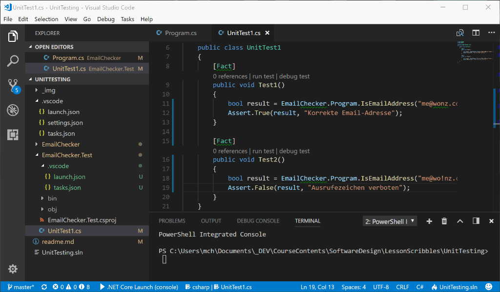

# Unit Tests

## Software Tests

Jedem ist schon mal ein Software-Fehler bei der Bedienung irgendeines Programms aufgefallen. 
Von unkritischem unerwartetem Verhalten bis hin zu Abstürzen und Datenverlust können die
Konsequenzen unterschiedlich ausfallen. Fakt ist: Beim Erstellen von Software passieren
Fehler. Je komplexer die Aufgabenstellung bei der Softwareentwicklung, je mehr Entwickler 
beteiligt sind, je größer der Zeitdruck für die Fertigstellung, umso mehr Fehler entstehen.
Die einzige Möglichkeit, Fehler zu beseitigen, ist, diese zunächst zu finden. Das geht  
mit _Software Tests_. 

Während bei Programmieraufgaben von der Komplexität einer Übungsaufgabe Entwicklung und
Test von ein- und der selben Person zeitgleich mit der eigentlichen Entwicklung einhergeht,
reicht schon bei vergleichsweise kleinen Software-Projekten, an deren Entwicklung mehr als 
eine Person beteiligt ist, ein reiner _Entwickler Test_ nicht mehr aus. Es gibt unterschiedliche
Test-Arten mit unterschiedlichen Testkriterien und -Zielen. Auf der 
Wikipedia-Seite zu Software Tests gibt es eine Kategorisierung in unterschiedliche 
[Teststufen](https://de.wikipedia.org/wiki/Softwaretest#Teststufen)
mit kurzen Definitionen zu jeder Stufe. Hier werden die unterschiedlichen Ziele der verschiedenen
Spielarten von Software-Tests klar. Bei unterschiedlichen Software-Projekten gibt es zudem 
unterschiedliche Ausprägungen der einzelnen Stufen. Tests für die Steuerungssoftware eines
Atomreaktors sehen anders aus als Tests für ein MMORPG. Eine Reihe dieser Teststufen 
kann nur mit hohem Personalaufwand (_Tester_) betrieben werden.

> #### TODO
>
> - Lest euch die Definitionen der [Teststufen](https://de.wikipedia.org/wiki/Softwaretest#Teststufen)
>   durch. 
> - Wählt eine euch bekannte Software aus und erläutert euch gegenseitig mit Beispielen, wie Ihr 
>   euch die jeweiligen Teststufen während der Entwicklung vorstellt.

Das Augenmerk dieser Lektion liegt auf ***automatisierbaren Tests***, die von Software-Entwicklern
während des Entwicklungsprozess' -quasi nebenher- erstellt werden. Mit dieser Art von 
Tests lassen sich nicht alle Testziele erreichen. Meist kann mit automatisierten Tests nur
die Funktionsfähigkeit auf Methoden-/Funktions-/Klassen- oder Modulebene erreicht werden.

Diese Art von automatisierten Tests, die von Entwicklern erstellt werden und die 
Richtigkeit einer abgeschlossenen _Software-Einheit_ testen, heißen ***Unit Tests***.

## Hello Unit Test

### Eine zu testende Methode 

Ganz oft beziehen sich Unit Tests auf einzelne Methoden. Hier ist eine, die getestet werden soll:

> #### TODO
> 
> - Legt ein Verzeichnis "UnitTesting" an. Legt diesem Verzeichnis ein weiteres Unterverzeichnis
>   Namens "EmailChecker"
>
> - Legt im Verzeichnis "UnitTesting/EmailChecker" ein C# Konsolenprogramm an (`dotnet new console`) und fügt 
>   folgende Methode ein
>
> ```C#
>  public static bool IsEmailAddress(string emailAddress)
>  {
>      int iAt = emailAddress.IndexOf('@');
>      int iDot = emailAddress.LastIndexOf('.');
>      return (iAt > 0 && iDot > iAt);
>  }
> ```

Die Aufgabe der Methode ist es, zu überprüfen, ob eine Zeichenkette
den Anforderungen an eine Email-Adresse genügt. Sie könnte z.B. aufgerufen werden, wenn Benutzer in einem Dialog ihre Email-Adresse eingeben, um zu überprüfen, ob das was eingegeben wurde, überhaupt eine Email-Adresse ist. Es ist klar, dass diese drei Code-Zeilen 
nicht die vollständigen Regeln über die Beschaffenheit einer E-Mail-Adresse überprüfen
(wen es interessiert, diese stehen in
[RFC 5322](https://tools.ietf.org/html/rfc5322), 
[Sektion 3.2.3](https://tools.ietf.org/html/rfc5322#section-3.2.3) und
[Sektion 3.4.1](https://tools.ietf.org/html/rfc5322#section-3.4.1)).

### Tests schreiben

> #### TODO
>
> Findet heraus, was die Methode macht, dazu:
>
> - Ruft oben stehende Methode aus der `Main` Methode mit verschiedenen Zeichenketten auf.
> - Setzt einen Breakpoint in der Methode und schaut ihr beim Arbeiten zu, während ihr 
>   Schritt für Schritt durch die Methode steppt. Schaut Euch Variableninhalte und 
>   einzelne Teile des Ausdrucks `(iAt > 0 && iDot > iAt)` im Watch-Fenster an.
> - Versucht, die Methode "übers Ohr zu hauen": Findet Zeichenketten, die keine Mail-Adressen
>   sind, bei denen aber `true` zurückgegeben wird (false positive).
> - Gibt es Zeichenketten, die email-Adressen sind, aber von `IsEmailAddress` nicht als
>   korrekte Email-Adresse erkannt werden (false negative)?
> - Lassen sich durch geeignete Wahl von `emailAddress` Abstürze provozieren?

In `Main` sollte es nun eine Reihe von Aufrufen unserer Methode `IsEmailAddress` geben. 
Für jeden dieser Aufrufe wird ein bestimmtes
Verhalten der Methode erwartet. Bei einigen Aufrufen wird erwartet, dass `true` zurückgegeben
wird, bei anderen `false`. Nicht immer verhält sich die derzeitige Implementierung der Methode
erwartungsgemäß.

### Test-Auswertung

Was wir nun haben, sind bereits eine Reihe von Tests der Methode. Die Methode wird mit Test-Fällen
aufgerufen und wir kennen bereits das erwartete Ergebnis. Für "echte" Unit-Tests fehlen aber noch ein 
paar Dinge: zum Beispieldie automatisierbare 
Ausführung und Überprüfung der Ergebnisse. Dazu könnten wir nun jeden Aufruf 

```C#
// Test 1
IsEmailAdress("ich@provider.com");
```
in etwas umgebenden Code einbetten, z.B. so:

```C#
// Test 1
string mailaddress = "ich@provider.com";
if (IsEmailAddress(mailaddress))
    Console.WriteLine("TEST PASSED: " + mailaddress + " korrekt als Email-Adresse erkannt");
else
    Console.WriteLine("TEST FAILED: " + mailaddress + " nicht als Email-Adresse erkannt, obwohl korrekt.");
```

Damit wird für den jeweiligen Testfall das Ergebnis daraufhin abgeprüft ob die Methode
das zu erwartende Ergebnis liefert oder nicht. 

> #### TODO
>
> - Bettet ein paar eurer Testfälle in Code nach obigem Muster ein, lasst das 
>   Programm laufen und beobachtet die Ausgaben.
>

Wenn ihr alle Eure Testfälle so einpackt und das Programm laufen lasst, erhaltet ihr nun 
eine Liste von durchgeführten Tests, sowie Ergebnisse, welche Tests korrekt absolviert 
wurden (TEST PASSED), und welche nicht (TEST FAILED).

> #### TODO
>
> - Wenn noch nicht geschehen: Macht Euch den Unterschied zwischen "string wird von `IsEmailAddress`
>   als gültig erkannt" und "`IsEmailAddress` liefert für string das erwartete Ergebnis" klar!
>   Man kann hier durcheinander geraten, weil beides Wahrheitswerte sind (`true`/`false`). Das erste 
>   ist ein Resultat, dass im Produktions-Code
>   verwendet werden soll (die Aufgabe der Methode). Das zweite ist das Testergebnis, ob später 
>   im Produktions-Code unsere Methode auch korrekt arbeitet. 
> - Erklärt euch gegenseitig, was in diesem Zusammenhang 
>   [_false positive_ und _false negative_](https://en.wikipedia.org/wiki/False_positives_and_false_negatives)
>   bedeutet.
>   

### Probleme

Im Prinzip haben wir nun schon einen Satz Unit-Tests für unsere "Unit" 
(=abgeschlossene Code-Einheit, in unserem Fall eine einzelne Methode). Es gibt aber noch 
ein paar Unschönheiten:

1. Der Test-Code ist nicht vom Produktionscode getrennt. Eigentlich sollte in `Main` ja 
   irgendwelcher Code stehen, der unsere Methode `IsEmailAddress` aufruft, weil tatsächlich
   ein String auf sein Brauchbarkeit als Email-Adresse überprüft werden soll.
2. Die Überprüfung, ob der Rückgabewert den Erwartungen entspricht, ist von Hand codiert (`if`) und
   mit der Text-Ausgabe verknüpft. Das ist zunächst mal unübersichtlich und führt 
   zu potenziellen Fehlern: Auch Tests können bugs enthalten. Wem ist es beim vorletzten
   **TODO** so gegangen, dass die falsche Erwartung überprüft wurde, weil vergessen wurde, 
   die Ausgabe von `"TEST PASSED"` und `"TEST FAILED"` passend zum Testfall zu vertauschen?
   Zudem gibt es auch andere 
   Sachverhalte als nur `bool`'sche Werte, die nach Ausführung einer Methode als zu erwartende
   Ergebnisse überprüft werden sollen, z.B. andere Typen von Rückgabewerten (`int` statt `bool`)
   oder irgendwelche _Seiteneffekte_, die eine Methode beim Aufruf auslöst.
3. Die Ausgabe des Testergebnis als Klartext auf der Konsole ist möglicherweise nur einer von
   mehreren gewünschten Arten, wie das Testergebnis dargestellt werden soll. In vollkommen automatisierten
   Umgebungen, sollen ggf. hunderttausende von Tests nach einem _Nightly Build_ eines großen Software-
   Paketes vollautomatisch durchlaufen werden. Als Ergebnis soll eine Liste nur der Tests, die 
   schiefgegangen sind, erstellt werden (wer will durch 99'999 `"TEST PASSED"`-Meldungen scrollen, um
   die eine `"TEST FAILED"` Meldung zu finden?). Eventuell lässt sich über ein Source-Control-System sogar
   zurückverfolgen, welcher Entwickler zuletzt an der Methode gearbeitet hat, die nun schief geht und
   direkt benachrichtigen.
4. Die Tests (im Moment in der `Main`-Methode) müssen von Hand gestartet werden. Nur der Entwickler 
   weiß, dass es ich dabei überhaupt um Tests handelt. Wünschenswert wäre
   eine automatische Auffindbarkeit der Tests, die in einem großen Software-Projekt über viele Module
   und Code-Dateien verstreut sein können.

## Unit Test Frameworks

Antworten auf die oben genannten "Unschönheiten" (und vieles mehr) liefern so 
genannte ***Unit Test Frameworks***. Diese gibt es für unterschiedliche
Programmiersprachen / Entwicklungsumgebungen / Plattformen mit variierendem Funktionsumfang
[in unübersichtlicher Anzahl](https://en.wikipedia.org/wiki/List_of_unit_testing_frameworks). 
Im Folgenden ein paar Namen nach Programmiersprachen geordnet.

- In der _Java_-Welt ist **JUNIT** das bekannteste Unit Test Framework.
- Für _JavaScript_ gibt es unter anderem: **Mocha**, **Jest**.
 **AVA** und **Jasmine**. Mocha ist auch in _TypeScript_ verwendbar.
- In _C++_ steht mit **Google Test** ein umfangreiches Framework zur Verfügung. 
- In dieser Veranstaltung arbeiten wir mit C# / .NET. Hier gibt unter anderem
  **NUnit** und [**xUnit.net**](https://xunit.github.io/), mit dem die folgenden
  Beispiele und Übungen implementiert werden.

## Tests mit xUnit .net

Es sollen nun die bereits angelegten Tests mit xUnit .net implementiert werden. 

### Ein Testprojekt anlegen

*** Anmerkung***: Wenn das Anlegen u.s. Solution und des dazugehörigen Testprojektes
nicht funktioniert, kann auch die in diesem Repository-Verzeichnis gespeicherte
Projektstruktur verwendet werden. Hier ist bereits das Produktions-Projekt "EmailChecker"
und das Test-Projekt "EmailCheckerTest" vorhanden.

Um die Trennung zwischen Produktionscode und Test-Code zu bewerkstelligen, werden
Unit Tests in einem eigenen Projekt/Modul gehalten. Nach dem Build stehen so dann
die Unit-Tests in eigenen DLLs zur Verfügung und müssen nicht mit ausgeliefert werden.

> #### TODO
> 
> - Wechselt mit der Kommandozeile (z.B. mit dem in Visual Studio Code eingebauten
>   Terminal (`Ctrl+Ö`)) in der in das übergeordnete Verzeichnis "UnitTesting".
> - Erzeugt mit dem Befehl `dotnet new sln` eine so genannte Solution-Datei.
>

Als Resultat sollte folgende Struktur vorhanden sein:
```
/UnitTesting
   UnitTesting.sln
   /EmailChecker
       Program.cs
       ...
```
Die Solution-Datei kann mehrere Projekte/Module enthalten, die dann als gemeinsames Software-Projekt
verwendet werden. Wir wollen nun neben unserem Produktions-Code im Projekt EmailChecker ein 
xUnit-Test-Projekt anlegen, in das die Tests ausgelagert werden.

> #### TODO
> 
> - Fügt zunächst das bestehende EmailChecker-Projekt unserer neuen Solution hinzu:
>   `dotnet sln add EmailChecker/EmailChecker.csproj`.
> - Erzeugt ein zweites Unterverzeichnis unterhalb von UnitTesting mit dem Namen
>   `EmailChecker.Tests`
> - Wechselt mit der Kommandozeile in dieses Verzeichnis (`cd EmailChecker.Tests`)
> - Erzeugt in diesem Verzeichnis ein neues xUnit-Test-Projekt mit
>   `dotnet new xunit`.
> - Da unser neues Testprojekt die Methode `IsEmailAddress` aus dem eigentlichen `EmailChecker` Projekt
>   aufrufen soll, müssen wir eine Referenz auf das `EmailChecker`-Projekt in unser 
>   `EmailChecker.Tests`-Projekt einfügen, und zwar mit:
>   `dotnet add reference ../EmailChecker/EmailChecker.csproj`
> - Schließlich wollen wir auch unser Test-Projekt der Solution hinzufügen. Wechselt dazu
>   zurück ins übergeordnete `UnitTesting`-Verzeichnis (mit `cd ..`) und fügt dann
>   das Projekt der Solution hinzu mit: `dotnet sln add EmailChecker.Tests/EmailChecker.Tests.csproj`

Nun gibt es im Verzeichnis `UnitTesting` die Solution-Datei `UnitTesting.sln`. Diese referenziert
die beiden Projekte `EmailChecker` und `EmailChecker.Testing` in den gleichlautendenden Unterverzeichnissen.

Als nächstes sollten die Tests aus der Main-Methode des `EmailChecker`-Projektes in das `EmailChecker.Testing` Projekt eingefügt werden.

> - Wenn noch nicht geschehen, öffnet in Visual Studio Code das übergeordnete `UnitTesting`-Verzeichnis. Da die xUnit-Unterstützung in Visual Studio Code manchmal nocht ein bisschen hakt, ist es vermutlich eine gute Idee, Visual Studio Code noch mal zu schließen und das übergeordnete `UnitTesting`-Verzeichnis noch mal in VS Code zu öffnen.
> - Betrachtet den Inhalt der Datei `EmailChecker.Test/UnitTest1.cs`, die beim Anlegen des
>   xUnit-Test-Projektes automatisch erstellt wurde.

Der Inhalt müsste in etwa so aussehen:

```C#
using System;
using Xunit;

namespace EmailChecker.Test
{
    public class UnitTest1
    {
        [Fact]
        public void Test1()
        {
        }
    }
}
``` 

### Tests einfügen

In einer Klasse namens `UnitTest1` gibt es nun eine Methode namens `Test1()`. Eine Besonderheit
fällt auf: über der Methode steht eine Zeile `[Fact]`. Dabei handelt es sich um ein so
genanntes *Attribut*, ein spezielles 
[Feature der Sprache C#](https://docs.microsoft.com/en-us/dotnet/csharp/programming-guide/concepts/attributes/)
, mit dem man Code-Bestandteile wie Klassen, Methoden, Parameter u.Ä. mit besonderen
Kennzeichnungen versehen kann. Jeder kann solche Kennzeichnungen (_Attribute_) selbst 
definieren und auch Code schreiben, der anderen Code auf das Vorhandensein solcher 
Kennzeichnungen untersucht und daraufhin bestimmte Aktionen auslöst.
In diesem Fall ist das Attribut `[Fact]` durch das xUnit-Framework definiert worden.
Es wird verwendet, um eine Methode als Test zu kennzeichnen. Somit können wir nun unsere
vorhandenen Tests in die Main-Methode einbetten. 

Allerdings soll das Ergebnis der Überprüfung, ob das erwartete Ergebnis eintritt oder nicht, 
nun nicht mehr direkt auf der Konsole ausgegeben werden. Stattdessen verwenden wir zur Überprüfung,
ob das von uns erwartete Testergebnis eintritt, Methoden der Klasse `Assert`.

> #### TODO
> 
> - Wandelt Eure Tests aus `EmailChecker.Main` nach folgendem Muster in Testmethoden um.
>   Pro Test in `Main` sollte dann in der Klasse `UnitTest1.cs` eine eigene Methode entstehen.
>
> ***Aus alt:***
> ```C#
> // Test 1
> string mailaddress = "ich@provider.com";
> if (IsEmailAddress(mailaddress))
>     Console.WriteLine("TEST PASSED: " + mailaddress + " korrekt als Email-Adresse erkannt");
> else
>     Console.WriteLine("TEST FAILED: " + mailaddress + " nicht als Email-Adresse erkannt, obwohl korrekt.");
> ```
>
> ***Wird neu:***
> ```C#
>    [Fact]
>    public void Test1()
>    {
>        string mailaddress = "ich@provider.com";
>        bool result = EmailChecker.Program.IsEmailAddress(mailaddress);
>        Assert.True(result, mailaddress + " nicht als Email-Adresse erkannt, obwohl korrekt.");
>    }
> ```
> Verwendet dabei `Assert.True` für Testergebnisse, bei denen ihr erwartet, dass  `IsEmailAddress`
> eine gültige Email-Adresse erkennt, und `Assert.False` für Testfälle, bei denen `IsEmailAddress`
> eine ungültige Email-Adresse erkennen soll.
> 
> - Da im Hauptprogramm (in der Methode `EmailChecker.Main`) nun kein Test mehr aufgerufen werden 
>   muss, könnnen wir nun eine Applikation schreiben: Fügt Code ein, der eine Email-Adresse von der 
>   Kommandozeile einliest und diese mit
>   Hilfe von  `IsEmailAddress` auf Korrektheit prüft, und das Ergebnis ausgibt.

Etwas gewöhnungsbedürftig ist die Verwendung von `Assert`. Die Methode `Assert.True` bekommt
als ersten Parameter einen `bool`'schen Wert und prüft, ob dieser
`true` ist. Falls ja, ist der Test bestanden. Falls aber, entgegen der Erwartung der Wert
`false` ist, hat die Methode `IsEmailAddress` nicht das erwartete Ergebnis geliefert: Der
Test ist fehlgeschlagen, es scheint ein Programmierfehler in der zu testenden Methode 
`IsEmailAddress` vorzuliegen. Als zweiten Parameter nimmt die Methode `Assert.True` eine
Zeichenkette entgegen, die zur Erläuterung bei der Auswertung fehlgeschlagener Tests
nützlich sein kann.

> #### CHECKPOINT
>
> Für die folgenden TODOs sollte nun die aus dem Nutz-Projekt und dem Test-Projekt bestehende
> Solution existieren und im Test-Projekt mindestens ein nicht funktionierender Test enthalten
> sein. 
> 
> Das in diesem Repository-Ordner enthaltene Projekt erfüllt diese Voraussetzungen.

### Tests laufen lassen

Die Test-Methoden können nun ohne expliziten Aufruf von anderer Stelle laufen gelassen
werden. Das xCode Framework findet die Methoden auf Grund des `[Fact]` Attributes.

> #### TODO
> 
> - Öffnet die in Visual Studio Code integrierte Kommandozeile (`Ctrl+Ö`). 
> - Wechselt mit `cd EmailChecker.Test` in das Verzeichnis des Test-Projektes
> - Mit `dotnet test` wird das Projekt gebaut und alle mit `[Fact]` dekorierten
>   Methoden ausgeführt. Dabei werden die mit Methoden der Klasse `Assert` formulierten
>   Erwartungen ausgewertet. Bei nicht eingetroffenen Erwartungen werden entsprechende
>   Ausgaben generiert.
> - Analysiert die Ausgabe des Testlaufs im Konsolenfenster. Was lässt sich hier herauslesen?

## Umgang mit Unit Tests

Wir kennen nun die Mechanismen, wie wir Unit Tests erzeugen und laufen lassen können. Wie
wird nun im Software-Entwicklungs-Alltag damit umgegangen?

### Test-Basis

Ein Ziel von Unit Tests ist es, den Produktionscode auf Knopfdruck mit einer möglichst umfangreichen
Menge von Tests auf Fehler zu untersuchen.

Durch einen Aufruf wie `dotnet test` z.B. nach jedem Build-Lauf, vor dem Commit in ein 
Source-Control-System, während der Testphase vor der Auslieferung o.ä. kann so überprüft werden,
ob irgendwelche Änderungen am Source-Code unerwartet Funktionalität, die vor der Änderung
die Erwartungen erfüllte, Fehler hervorruft. Die in der Software-Entwicklung häufig vorkommende
 "Verschlimmbesserung"
- man versucht an einer Stelle eine Verbesserung zu erreichen, baut unwissentlich an anderer Stelle
durch die Änderung aber Fehler ein - kann so eingegrenzt werden.

Neben dem eigentlichen Protuktionscode muss dazu auch eine umfangreiche Bibliothek von Unit Tests
entwickelt und gepfelgt werden. Dabei spielt neben der Anzahl der Tests auch 
die Qualität der Tests eine Rolle. Es ist sehr wahrscheinlich, dass bestimmte Fälle gar nicht 
in Tests abgeprüft werden. Genauso wie das Entwickeln von Produktionscode ist auch das Schreiben
von Tests eine Fähigkeit, die erlernt sein will. Unter Umständen werden Teile des Produktionscodes gar nicht
von Tests abgedeckt, während andere mehrfach mit sehr ähnlichen, nicht sehr aussagekräftigen Tests
abgeprüft werden.

Wie kann nun in einem großen Projekt gewährleistet werden, dass Entwickler in ausreichender Zahl
und Qualität Tests generieren und sich nicht nur auf den Produktionscode stürzen, diesen zwar 
möglicherweise noch einigermaßen fehlerfrei zum nächsten Release entwickeln, den Code aber dann sich
selbst überlassen und zukünftige Änderungen ggf. zu Fehlern führen, weil keine Tests da sind?

Antworten darauf geben Verfahrensweisen, die unter Schlagworten wie  
[***Test Driven Development***] oder [***Test First***] zusammengefasst sind. 
darunter versteht man die Herangehensweise, vor der ersten Zeile Produktionscode
einer Methode oder Klasse zunächst einen oder mehrere Tests zu schreiben, die die Erwartungen
an das Verhalten der Klasse definieren. Die Methode oder Klasse liegt dann zunächst als reine
Dummy-Implementierung vor: Alle Methoden tun noch nichts. Daher werden alle Tests zunächst
fehlerhaft verlaufen. Der Produktionscode entsteht dann durch das sukzessive "korrieren" der
Tests: Nach und nach werden die Methoden so mit Leben gefüllt, dass Test um Test positiv verläuft.
Am Ende entsteht so Produktionscode, der alle Erwartungen erfüllt.

Ob und wenn ja wie intensiv dieses Verfahren zum Einsatz kommen kann, hängt von ein paar Voraussetzungen ab.

- Organisation: Es muss gewährleistet sein, dass Entwickler genügend Zeit für dieses Vorgehen
  zur Verfügung haben. Die Geschäftsleitung/der Auftraggeber muss den Vorteil einer 
  zeitgleich entwickelten Testbasis erkennen und fördern.

- Entwurf: Um die Erwartungen präzise im Testcode mittels ja/nein Entscheidungen formulieren zu können,
  muss ein gut ausgearbeiteter Software-Entwurf vorliegen. Das ist u.U. nicht immer möglich. Oft
  besteht ein großer Anteil in der Software-Entwicklung aus forschenden Tätigkeiten, bei denen die
  zu erwartenden Ergebnisse nicht immer vorab fest stehen.

- Testbarkeit: Lassen sich Eingaben für einen UnitTest leicht im Rahmen eines Tests generieren? 
  Wie Aufwändig ist es, die Ausgaben auf das zu erwartende Ergebnis zu überprüfen? Ggf. handelt es
  sich bei den Eingaben um Benutzereingaben, bei denen die Zeitliche Abfolge das Ergebnis beeinflusst.
  Die Ausgaben sind vielleicht grafischer Natur, so dass ein Bildvergleich notwendig ist, um die
  Erwartungen zu überprüfen. U.u. ist der Aufwand, einen Test zu schreiben, zu hoch.

> #### TODO
> - Mindestens einer der Tests in eurem Projekt schlägt derzeit fehl. Fixt diesen  
>   Test, in dem Ihr den Produktionscode so lange ändert, bis nicht dur dieser Test
>   sondern auch alle anderen Tests positiv verlaufen.

## "Test Driven Debugging"

Eine pragmatische Herangehensweise, die sich nicht dem Diktat unterwirft, für jeden Fall
einen Test zu generieren, aber trotzdem über die Zeit hinweg dafür sorgt, dass eine 
wachsende Zahl von relevanten Tests entsteht und darüber hinaus eventuell sogar noch
Entwicklungszeit spart, ist folgende:

- Ein Fehler, der z.B. durch einen Bug-Report eines Kunden bekannt wurde, soll behoben werden.
- Ein Entwickler muss sich mit dem Fehler auseinandersetzten, dazu muss der Fehler zunächst
  reproduziert und dann eingegrenzt werden. Oftmals muss der Fehler während der Behebung (Bug-Fixing)
  sehr oft hintereinander reproduziert werden, damit der Entwickler den Fehler erkennen und schließlich
  entfernen kann.
- Statt den Fehler ständig durch Bedienung der Software hervorzurufen, schreibt der Entwickler
  einen Test, der den Fehler reproduziert. 
- Der Fehler kann somit während des Bugfixing auf Knopfdruck reproduziert werden und der Entwickler
  kann mit dem Debugger direkt an der Stelle, an der der Fehler auftritt, aktiv werden. 
- Ist der Fehler behoben, ist die Testbasis um einen Test erweitert worden. Es wird auch in Zukunft
  bei automatischen Tests überprüft, ob dieser Fehler nicht wieder auftritt. Der Test ist von
  Relevanz, denn er testet einen tatsächlich aufgetretenen Fehlerfall.

Dieses Verfahren wird von zeitgemäßen Entwicklungsumgebungen und Code-Editoren dadurch unterstützt,
dass einzelne Tests auf Knopfdruck in der Entwicklungsumgebung im Debugger startbar sind.
In Visual Studio Code steht diese Funktionalität über die "Code Lens" zur Verfügung: Über 
allen mit `[Fact]` dekorierten Methoden erscheinen im Code Editor die Optionen `run test` und `debug test`:



> #### TODO
>
> - Setzt einen Breakpoint in der Methode `IsEmailAddress` (im Produktionscode).
> - Startet einen der Tests, bei denen das erwartete Verhalten nicht eintritt.
>
> Resultat: Die Programm-AusführungIhr steht auf Knopfdruck in der fehlerhaften Methode, die bereits mit den
> Daten aufgerufen wurden, die zum Fehler führen. 
> 
> - Analysiert den Fehler und behebt ihn.
>  
> Resultat: Die Methode ist etwas besser geworden und Ihr habt einen weiteren Test
> in Eurer Test-Bibliothek.
> 

## Aufgabe

- Erzeugt mindestens vier weitere Tests ("Test First"), die zunächst falsch laufen und verbessert an diesen die Methode `IsEmailAddress`. Ideen, wie ihr zu sinnvollen Tests kommen könnt:
  - _false positive_ Tests lassen sich vermutlich erst mal leichter finden. Nachdem ihr in jedem Schritt aber
    die Möglichkeit, was noch alles als Email-Adresse durchgeht, weiter einschränkt, gibt es nach jedem Schritt
    auch eine größere Wahrscheinlichkeit, _false negative_ Testfälle zu finden. Versucht es!
  - Entnehmt eure Annahmen darüber, wie eine Email-Adresse beschaffen sein muss, den oben genannten Spezifikationen.
  - Gleicht die Top-Level-Domain der zu prüfenden Email-Adresse mit der 
    [offiziellen Liste der Top-Level-Domains](http://data.iana.org/TLD/tlds-alpha-by-domain.txt) ab.

- Überlegt Euch, ob und wie man Tests zusammen legen kann. Was sind Vor- und Nachteile Eurer Vorschläge?

- Neben `[Fact]` gibt es auch noch `[Theory]` in xUnit .net. Wo ist der Unterschied? Wie sähe eine
  sinnvolle Anwendung für `[Theory]` beim `EmailChecker`-Test aus?
  

## Seminar-Themen

 - Mock-Objects
   - Begriffsedinition, Anwendungsfälle
   - Beispielprojekt

 - Test-Driven Development
   - Entwicklungsprozess(e) erklären & vergleichen
   - Einbettung in agile Methoden / Abgrenzung zu agilen Methoden

 